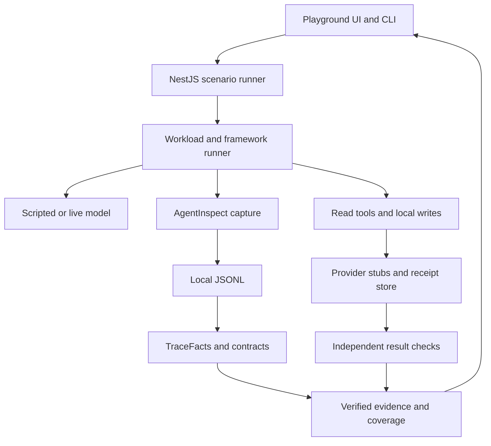
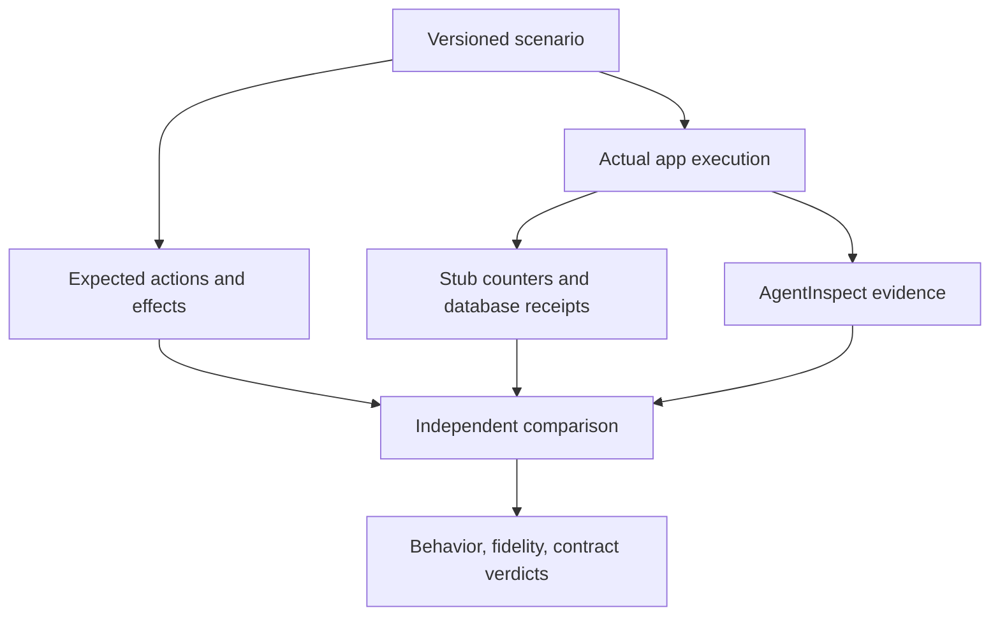

# AgentInspect Playground: implementation and validation plan

Prepared for Raju Dandigam · 26 September 2026

## 1. Direction

Repurpose `proactive-ai-demo` as **AgentInspect Playground**, an independent NestJS application that exercises AgentInspect as a real consumer. Keep the current trip-attention workflow as the first workload. Add scenarios because they expose a trace, contract, integration, or lifecycle behavior that needs evidence.

The development loop is:

**Public capability → realistic workload → controlled variation → independently observed result → captured trace → deterministic checks → portable evidence → minimal library regression.**

This is an application and consumer conformance lab. Application orchestration, provider requests, fault injection, fixture playback, and persistent business state belong here. AgentInspect remains the local evidence debugger and trajectory-test toolkit. Do not move the scenario runner, hosted API clients, model pricing, or replay execution into AgentInspect core.

The best first milestone is one repeatable command that runs the existing scenarios with tracing enabled, checks the actual outbox and model-call counts independently, evaluates saved traces, and creates a verified evidence package. Additional APIs become useful once this loop works.

## 2. Reviewed baseline and concrete gaps

This plan was prepared by reading repository files through GitHub. It is **source reviewed**, not an implementation or a completed test run. No live inference, API workloads, package builds, or application tests were executed for this plan.

| Source | Pinned revision reviewed | Observed state |
| --- | --- | --- |
| `rajudandigam/proactive-ai-demo` | `5981a1bf0a81dfb576b8fbf14bd169737f0c24aa` | V2 NestJS app, six Jordan scenarios, UI/SSE, fixture and OpenAI paths |
| `rajudandigam/agent-inspect` | `3c3cbeda9c41776e67d79b068b4e28437c28cb23` | Root and public package manifests at `6.31.7` |
| Demo lockfile | Same demo revision | `agent-inspect 6.31.7`, LangChain core `0.3.80`, LangGraph `0.2.74`, OpenAI SDK `5.23.2`, Vitest `3.2.7` |

These are reviewed versions, not a claim about the future npm `latest` tag. Phase P00 must record the actual published and installed versions before implementation.

What to retain:

- The NestJS dependency injection setup and existing API/CLI entrypoints.
- The six travel presets, policy and validation code, fixture tools, and preview outbox.
- The server-rendered/static UI and SSE run experience.
- The real OpenAI tool-calling and structured-output path.
- The existing 15 behavior tests as a regression baseline.

What needs attention first:

1. `TripAttentionAgentService.run()` wraps only the **live agent** in `maybeInspectRun`. Fixture mode returns before that wrapper. Policy-only and required-alert paths therefore cannot demonstrate complete request coverage through this integration.
2. `DemoTraceService` supplies separate UI events. There is no verified one-to-one reconciliation between those events, application outcomes, and persisted AgentInspect evidence.
3. The outer `StateGraph` has seven linear nodes. Investigation/tool iteration is a `while` loop inside `runLive()`. Preserve this useful baseline, then build an explicit graph-loop runner to exercise real conditional graph edges and callback propagation.
4. `step.tool()` can receive `{ok:false}` as a normally returned value; a caught provider failure can also become a normally returned agent result. Record transport/step completion and business outcome separately. A returned object does not prove the operation succeeded.
5. Existing live evaluation checks before-departure and quiet-hours cases. It does not yet cover all six presets, all adapters, plugins, contract rules, lifecycle failures, or evidence exports.
6. The current in-memory stores and event buffers need bounded retention, cleanup, shutdown handling, and persistent fixtures for restart tests.
7. Direct instrumentation is appropriate for the present LangChain `0.3.x` app. The reviewed `@agent-inspect/langchain` package requires `@langchain/core ^1.0.0`; install that adapter in an isolated compatible runner first.

Do not repeat old findings as current defects. Earlier confidence-threshold, paired-event counting, circuit-summary, status-validation, and release-script reports become regression candidates. Reproduce each against the pinned package before assigning a defect.

There are some historical descriptions in API/support/state documents. Use the current installed declarations, source, tests, and package manifests to resolve conflicts; record the disagreement in the audit. For example, the current root export snapshot contains seven runtime exports, including `observeOutcome`.

## 3. Workloads that earn their place

| Workload | User-facing example | AgentInspect behaviors it exposes |
| --- | --- | --- |
| Trip attention | Combine preparation and weather; wait for arrival; suppress obsolete hotel search; alert on flight change | Policy bypass, conditional work, zero-model paths, validation, duplicate delivery, session correlation |
| City day planner | Given a city, date, dietary preference, and radius, find weather and nearby restaurants/hotels, then propose a plan | Parameterized tools, parallel reads, cache branches, partial failures, evidence freshness, arguments, bounded loops |
| Evening planner | Recommend a film, or a TV series in the keyless variant, with sourced metadata | Second domain, search/detail tools, structured output, missing facts, streaming and cancellation |
| Travel helpdesk | Answer a question from a small versioned local policy corpus | Retrieval-before-generation, citations, source IDs, grounded-answer heuristics, conflicting/insufficient evidence |
| Local reservation simulator | Hold a mock room/table, obtain approval, confirm once, and reconcile an uncertain write | Side effects, explicit approval, idempotency, retries, timeout ambiguity, independent receipt observation, worker restarts |

The reservation simulator uses a local HTTP service and database. It never creates real reservations, payments, or notifications. The independent service is valuable because it can record that a write happened even when the agent never received the response.

Use five execution shapes across these workloads:

- A simple deterministic pipeline for baseline and no-model cases.
- A bounded model/tool loop.
- Parallel read branches that join before synthesis.
- A supervisor delegating to two real child workflows, then validating their results.
- A durable queued continuation or approval/resume flow spanning multiple physical executions.

Delegation must actually happen in application/framework code. Do not manufacture a swarm by renaming flat trace rows. A scripted model can drive deterministic tests through the real orchestration implementation.

## 4. External data choices

“Free API,” “open data,” and “open-source server” are different properties. Keep the provider adapter replaceable, store attribution/provenance, and use local data for repeated tests.

| Need | Initial choice | Practical boundary |
| --- | --- | --- |
| City lookup and weather | Open-Meteo geocoding and forecast | Keyless hosted access for qualifying non-commercial use; source is available. Hosted terms and attribution still apply. Use fixture coordinates/date for CI and a current date within the forecast horizon for live runs. |
| Nearby restaurants and hotels | A bounded OpenStreetMap/Overpass lookup | Returns mapped places and tags, not live room availability, prices, verified opening hours, ratings, or restaurant reservations. Public instances suit a few manual development queries; retain fixtures and use an owned service/extract for routine workloads. |
| Movies | TMDB, optional server-side API key | Free non-commercial use with required attribution; TMDB's API is closed source. Metadata is not cinema showtime or ticket availability. |
| Keyless entertainment | TVmaze | TV shows/episodes, not a substitute movie catalog. Preserve its attribution and ShareAlike requirements; handle 429s. |
| Policy/document search | Versioned local Markdown/JSON corpus | Stable source IDs and document hashes; begin with lexical retrieval. Embeddings can be an isolated later profile. |
| Bookings and writes | Local reservation simulator | Authoritative local receipts support failure and reconciliation tests. |

Do not make public Nominatim the default agent geocoder. Its public service has strict use restrictions, including a one-request-per-second application-wide limit, identifying headers, caching, and no client autocomplete. Open-Meteo city search is sufficient for the initial workload. A future Nominatim integration should use an owned deployment or a separately deliberate provider choice.

Provider adapter requirements:

- Explicit allowlisted endpoint configuration; the model supplies validated parameters, never an arbitrary URL.
- Argument schemas and limits on radius, result count, dates, payload size, and duration.
- Cache keys derived from normalized arguments and provider/version; TTL and `fetchedAt`/`validAt` included in results.
- Source identity, source item IDs, endpoint origin, attribution, and normalized response hash.
- Timeouts, abort propagation, Retry-After handling, bounded read retries, and typed errors.
- No real API traffic from fixture suites. Faults, stress, and repeated property tests use local servers.
- Missing credentials or unavailable providers produce a clear blocked/unsupported result, never a silent switch from live to fixture.
- Unknown fields stay unknown. An absent opening-hours tag cannot become “open now.”

## 5. Proposed architecture

Keep one npm-based repository. Extend the current structure rather than immediately converting it to a monorepo or changing package managers.



Separate the runner’s intent and observation from the tracing system under test:



Suggested additions:

| Location | Responsibility |
| --- | --- |
| `src/playground/` | Scenario registry, requests, results, orchestration API, artifact lookup |
| `src/workloads/` | Travel, city, evening, helpdesk, reservation workflows; migrate incrementally |
| `src/providers/` | Scripted/live model providers, weather/places/catalog adapters |
| `src/instrumentation/` | Manual capture, correlation, diagnostics, bounded metadata |
| `src/verification/` | Independent assertions over provider stubs, application state, and receipts |
| `scenarios/` | Versioned scenario specifications with expected behavior and feature IDs |
| `contracts/` | Actual AgentInspect contract/config files, validated against installed types |
| `fixtures/` | Original app fixtures plus reviewed external response fixtures |
| `tests/consumer/` | Packed-package/public-import tests, not imports of AgentInspect source internals |
| `integration-apps/` | Isolated framework/version runners with their own manifests and lockfiles |
| `plugins/` | Explicit local example plugin packages and their manifests |
| `scripts/lab/` | Inventory, runs, evidence, compatibility, and coverage commands |
| `artifacts/` | Ignored raw/local execution outputs; reviewed retained specimens elsewhere |
| `evidence/regressions/` | Small sanitized, intentional regression cases safe to retain in Git |

Do not create a custom trace parser for the UI. Use the AgentInspect reader/TraceFacts APIs and link to the existing viewer/Studio for detailed exploration.

## 6. Execution modes and identities

Configure model mode and tool-data mode independently:

| Profile | Model | Tools | Purpose |
| --- | --- | --- | --- |
| `offline` | Scripted provider | Local fixtures/stub services | Mandatory deterministic CI |
| `live-model` | Real OpenAI call | Fixed local responses | Isolate model variability from data changes |
| `live-tools` | Scripted provider | Explicit public providers | Verify HTTP adapters independently |
| `live-full` | Real OpenAI call | Live read providers; local simulated writes | End-to-end exploration |
| `recorded-tools` | Scripted or live, explicitly selected | Reviewed saved responses | Repeat a known external-data situation |
| `artifact-review` | None | None | Open an earlier execution; never count as a new run |

Use fixture playback at the application boundary. AgentInspect does not replay historical agent execution. A screenshot or reopened trace is not another physical run.

Each actual execution receives a new ID. Keep these distinct:

- `batchId`: invocation of a suite or experiment.
- `scenarioId` + `scenarioVersion`: reproducible case definition.
- `executionId`: one actual application attempt, including resumed worker executions.
- `agentInspectRunId`: mapped ID(s) from the capture path, not assumed identical to execution ID.
- `sessionId`/`groupId`: related runs or conversation.
- `requestId`/`correlationId`/`decisionId`: explicit business/request correlation.
- `operationId`: one logical read/write operation.
- `attemptId` + `attemptNumber` + `retryOf`: physical attempts and chronological links.
- `toolCallId`, framework run/span IDs, `subAgentId`, `workflowStep`: source-provided identities.

Record both scenario time and actual UTC timestamps. Never use the fixed scenario clock to manufacture latency, event ordering, or proof of completion.

## 7. Public-surface coverage

The reviewed source has **18 public packages**, counting `agent-inspect`; `packages/core` and `packages/cli` are private implementation packages, and the VS Code package is private. Core has **10 subpaths** in addition to the root. Its committed runtime export snapshot contains **359 root/subpath value entries**, including constants and aliases. This is not 359 distinct methods and does not include all scoped-package APIs, types, or instance methods.

The supplied `AgentInspect_Coverage_Seed.json` records that reviewed inventory and marks everything **planned**. P00 must compare it with packed/current packages and extend it. Do not use the seed as proof of test coverage.

| Public surface | Required consumer coverage |
| --- | --- |
| Root `agent-inspect` | `inspectRun`, `maybeInspectRun`, `step`, `step.tool`, `step.llm`, `observe`, `observeOutcome`, correlation helpers, `createInspector`; sync/async results, errors, disabled mode, parallel/nested isolation |
| Inspector instance | `run`, `step`, `tool`, `llm`, `observe`, `observeOutcome`, diagnostics, flush, close; independent instances and global-helper mixing limitations |
| `/writers` | memory, file, buffered file, composite, null; ordering, overflow modes, serialization/FS failures, flush/close, shutdown and documented crash loss |
| `/readers`, `/persisted`, `/logs` | All supported schema versions, mixed traces, local OTLP/OpenInference, detection/ambiguity, multi-run input, JSON/log4js mapping, confidence, partial tails, warnings, migration |
| `/checks` | TraceFacts, logical projection, every rule family, TraceContract, lint/explain, actor scope, observations/provenance, retry controls, argument evidence, TOOL/LLM ordering |
| `/diff`, `/exporters` | Structural comparison, unknown fields, HTML/Markdown safety, OTLP/OpenInference validation, semantic preservation and explicit loss |
| `/reporters`, `/workspace`, `/advanced` | Evidence CI artifacts, workspace confinement/lifecycle, sessions/outcomes, suites/cohorts/gates, diagnostics, summary agreement; enumerate every exported value/type and map to a meaningful case |
| `@agent-inspect/langchain` | Real compatible LangChain/LangGraph invocations, fidelity classes A–E, stream metadata, handler reuse, late callbacks, finalize/flush/close, truthful parentage |
| `@agent-inspect/ai-sdk` | `generateText`/`streamText` and tools; separate integration per concurrent generation, native telemetry, metadata/preview limits, lifecycle diagnostics |
| `@agent-inspect/openai-agents` | Native processor, agents/tools/handoffs/guardrails, replacement of default trace processors in local mode, flush/shutdown where exposed |
| `@agent-inspect/mcp` | Wrapped real MCP client, list/call lifecycle, proxy methods, logical vs physical call identity, tool errors, cancellation and disconnect |
| `@agent-inspect/mcp-server` | Enumerate tool catalog; initialize/list/call protocol, facts/summary/contract/diff parity, resource boundaries, untrusted trace content and output bounds |
| `@agent-inspect/harness` | Actual NestJS bootstrap → target invocation → shutdown; bootstrap, fixture, target, and shutdown failures |
| `@agent-inspect/eval` | Every exported deterministic rule, success/error/unreadable cases; source/citation/overlap/length heuristics; no semantic-truth claim |
| `@agent-inspect/guardrails` | Each exported rule and runner; positive/negative/insufficient input; shape, unsafe arguments, oversized output, synthetic PII and injection cases |
| `@agent-inspect/circuit` | Each analyzer: tool repetition, same arguments, retries, loop iterations, runaway LLM loop, timeout, branch width; logical counts and summary inclusion |
| `@agent-inspect/redact` | Public methods, nested key variants, URL/connection strings, errors, previews, preserved safe token metadata, before-disk and exported-artifact checks |
| `@agent-inspect/vitest`, `@agent-inspect/jest` | Actual runner/reporter execution, pass/fail artifacts, experimental matchers, missing evidence, concurrency; isolate Jest consumer dependencies |
| `@agent-inspect/adapter-sdk` | Registration, fixture/conformance helpers, privacy checklist, plugin manifests, transforms, renderers, indexers; explicit installation |
| `@agent-inspect/index-sqlite` | Build/query/status/rebuild/staleness/corruption/clean; compare with JSONL; missing optional native dependency; platform-specific results |
| `@agent-inspect/viewer`, `@agent-inspect/studio` | Real servers, views and read-only behavior; projects/runs/search, bounded imports, disabled ingest defaults, path boundaries, screenshot smoke |
| `@agent-inspect/tui` | Real PTY launch/navigation/exit, malformed and large traces, non-TTY behavior; do not certify through screenshots alone |

For every public function and method, record a test ID and evidence path. Constants need shape/value compatibility tests; types need compile-only consumer cases; pure helper functions need representative behavior tests. Do not add fake app features just to call a constant. Export coverage, behavioral scenario coverage, and source code coverage are separate numbers.

Private VS Code implementation gets a separate repository-level/manual smoke lane. Do not invent an installable public package for it. Keep the library’s own unit/release gates in the library repository; the playground adds independent consumer evidence.

### CLI scope

Discover command trees from the installed local binary and source registration. Capture `--help` recursively and test required arguments, accepted/rejected flags, stdout/stderr separation, exit codes, empty input, malformed input, and valid outputs.

Observed command families include `list`, `view`, `clean`, `logs`, `tail`, `export`, `open`, `migrate`, `check`, `serve`, `viewer`, `studio` and its import subcommands, `eval`, `scan`, `verify-safe`, `artifacts`, `bundle`/`verify`/`open`, `ci-summary`, `diff`, `timeline`, `stats`, `search`, `sessions` and subcommands, `session`, `what`, `report`, `redact`, `explain`, `init`, `doctor`, `plugins`, `index`/`sqlite`, `workspace`, `suite`, `cohort`, `mcp configure`, and `gate`.

A README mentions a harness CLI, but the reviewed central registration does not show a `harness` command. Verify installed behavior before generating commands. Record any such mismatch instead of inventing syntax. Destructive cleanup tests operate only inside disposable test directories.

## 8. Scenario corpus

The accompanying `AgentInspect_Scenario_Catalog.json` contains **64 planned scenario families**. A family expands into parameterized cases; it is not a claim that 64 tests cover all combinations.

| Group | Main purpose |
| --- | --- |
| S01–S08 | Existing travel outcomes, required alerts, deduplication, concurrency |
| S09–S16 | Public read providers, caching, partial results, live accounting, stream/cancel behavior |
| S17–S24 | Recovery, write uncertainty, approval, resume/restart, multi-agent nesting |
| S25–S32 | Retrieval, grounding, malicious tool data, loop limits, multi-turn sessions |
| S33–S40 | Manual APIs, writers, disk/serialization failures, lifecycle projection, malformed/legacy input |
| S41–S48 | Contract semantics, rule accounting, scope, provenance, evidence redaction/integrity |
| S49–S56 | Native adapters, MCP roles, plugins, reporters/matchers |
| S57–S64 | CLI parity, workspace/index/UI, standards, coexistence, performance, packed compatibility, library feedback |

For every applicable rule or invariant create three cases:

1. A valid trajectory passes.
2. A deliberately invalid trajectory fails for the intended reason and references the relevant events.
3. Missing evidence stays unknown/insufficient, or fails as documented. It cannot silently prove success.

Useful mutations include dropping one terminal event, doubling a lifecycle row, reordering a causal boundary, replacing an argument with only a preview string, changing a parent or actor ID, removing a required observation, changing a contract after evidence creation, and truncating a JSONL tail. Mutations are clearly labeled derived fixtures. They are never counted as live executions.

### Tests with particularly high library value

- One TOOL start plus completion counts as one logical tool call; repeated real attempts remain separate.
- TOOL-only order and typed TOOL→LLM order are distinct. LLM names cannot satisfy a TOOL requirement.
- First-occurrence, happens-before, and all-occurrences differ on overlaps and late repetitions.
- Presence requirements and low-level compositional ordering are tested separately.
- `explicit`/`correlated`/`heuristic`/`unknown` relationship-confidence thresholds are validated against the actual accepted vocabulary; adapter fidelity labels are not blindly reused as check thresholds.
- Contract `allowedStatuses` rejects invalid vocabulary where specified; do not silently normalize typos into an allowed status.
- Circuit findings appear in aggregate counts, evaluated-rule summaries, JSON, and CI results consistently.
- Recovered failures stay visible; fallback has an earlier linked failure; two unrelated calls with the same display name are not a retry.
- A timed-out write stays uncertain until the independent receipt service resolves it. A client idempotency key alone is not proof of exactly-once execution.
- A zero-model policy run generates inspectable evidence without a fictional LLM event.
- Metadata-only capture cannot satisfy structured argument assertions unless safe structured evidence was explicitly supplied.
- Redaction failures, broken bindings, or missing evidence never become a green share-safe verdict.
- Two inspector instances, overlapping framework calls, and queue workers do not mix parentage or sessions.

## 9. Three independent verdicts

Every scenario result records:

| Verdict | Question | Evidence source |
| --- | --- | --- |
| Application behavior | Did the app perform the expected actions and effects? | Stub counters, HTTP responses, outbox state, database receipts, explicit assertions |
| Capture fidelity | Does the trace faithfully describe that execution within the capture mode? | Source lifecycle observations compared with persisted trace identities/counts/relationships |
| Contract behavior | Did the check engine pass/fail/diagnose as expected? | AgentInspect API/CLI results and event-linked findings |

Then compute the **scenario test verdict**. A deliberately failing contract is a passing test only when the expected failure is observed and attributed correctly. Preserve the underlying failed contract result in the evidence. Never recolor the unsafe trajectory as safe.

The independent verifier must not derive its expected model-call count or write count from AgentInspect events. Instrument the fake/live-provider gateway and the local effect store separately. Capture public model requests/responses only in bounded, deliberately sanitized application records; never request hidden chain-of-thought.

Do not assert exact prose for live output. Assert allowed tools/actions, fact/source linkage, schema, budgets, actual effects, and trace fidelity. A policy-permitted suggestion can legitimately be silent. Repeat a fixed, declared number of live trials and retain all failures; never rerun until green and discard earlier attempts.

## 10. Evidence contract

Every execution writes a new directory, never overwriting another run:

`artifacts/<batchId>/<scenarioId>/<executionId>/`

Expected files, when applicable:

| File | Contents |
| --- | --- |
| `manifest.json` | App/library revisions, installed versions, lock hash, OS/arch/Node, scenario/fixture/prompt/model settings, mode, time window, command, budgets, result status |
| `input.safe.json` | Redacted input plus fixture IDs/hashes |
| `output.safe.json` | Actual application result with provider/fixture labels |
| `oracle.json` | Independent assertions, call counts, receipt IDs, observation method, bounded verification window |
| `trace.jsonl` or `traces/` | Original captured AgentInspect evidence, already sanitized at persistence boundaries |
| `trace-facts.json` | Derived normalized facts and diagnostic warnings |
| `contracts/` | Exact resolved contract/config and its hash |
| `checks.json`, `report.json`, `diff.json` | Actual tool outputs; only include files for commands run |
| `diagnostics.json` | Inspector/adapter/writer warnings, overflow, dropped/late events, unavailable fields |
| `stdout.txt`, `stderr.txt`, `commands.json` | Redacted process output, argument arrays, exit codes, durations |
| `safe/` | Share-profile exports, exact safety-scan results, verified evidence package |
| `screenshots/` | UI evidence where relevant; supplements machine-readable checks |

The manifest also distinguishes source kind: `physical-execution`, `recorded-tool-execution`, `synthetic-trace`, or `mutated-trace`. Record fixture capture provenance, hashes, attribution, capture mode, exact package integrity/tarball hashes, requested/returned model IDs, available provider request IDs, actual attempts, token usage availability, and instrumentation owner.

Mark unknown usage/cost as unknown. Preserve completion status and acceptance window for negative claims such as “no second write occurred.” Avoid claims of permanence beyond the observed window.

Build final checksums **after** redaction and contract resolution. Include all retained files except the checksum index itself; verify them on readback. Hashes establish byte consistency, not independent truth. Evidence contract binding must be checked with AgentInspect’s verifier where supported.

Save source traces unchanged after capture. Redaction and mutations produce new files. If a raw trace unexpectedly contains a synthetic secret canary, fail the capture test and restrict that local artifact; do not publish it as a sanitized specimen.

Keep business completion and artifact finalization as separate states. Await inspector/adapter flush and close before final checks, checksums, and the ready-to-download flag. A crashed or incomplete run gets an explicit incomplete manifest; it cannot inherit a previous successful run's artifacts.

## 11. Test lanes and budget

| Lane | Network/model behavior | Gate |
| --- | --- | --- |
| Fast deterministic | No external network; scripted model; real app/framework code | Required for ordinary PRs |
| Consumer matrix | Packed/npm packages in fresh child projects, local stubs | Required before a compatibility claim |
| Fault and lifecycle | Local HTTP/effect service, subprocess kill/restart, fake clock | Required for affected features |
| Live model | Explicit real model, fixed tools | Manual or separately configured CI job |
| Live providers | Small provider-specific smoke budget | Manual; external outages classified separately |
| Full live | Model + reads, simulated writes | Exploration and retained examples |
| Interop | Owned Collector/Phoenix/Langfuse services | Separate Docker profile |
| Performance | Local stubs and fixed generated corpus | Separate benchmark lane |

Proposed initial live limits: 10 scenario executions per command, at most 5 model attempts per execution, maximum 1,500 output tokens per call where the selected model supports that limit, one live execution at a time, and explicit overall/per-call deadlines. These are playground settings, not AgentInspect capabilities. Before launch display the planned upper bounds. Reserve budget atomically before every call, including final structured-output calls and fallback attempts.

A dollar limit is only enforceable with a current, explicit price table and conservative reservations; otherwise label cost unavailable and enforce call/token limits. Capture actual usage when provided. No hidden retries in provider SDKs: disable them or surface each physical attempt through a verified transport hook.

Benchmark tracing disabled, null writer, memory writer, file writer, buffered writer, and the framework adapter on the same local workload. Use warmup, fixed repetitions, median/p95, RSS, events/bytes, CPU or wall time, and dropped-event diagnostics. Report measured overhead; do not set a universal millisecond SLA without a baseline. Large-corpus tests must be bounded by an explicit resource profile.

## 12. Third-party integration priorities

| Priority | Integration | Test goal |
| --- | --- | --- |
| First | Real LangGraph/LangChain, AI SDK 6, OpenAI Agents JS | Exercise each official adapter with the same workload inputs and independent expected effects |
| First | Actual local MCP client/server | Distinguish application tool capture from read-only evidence inspection |
| Next | Local OpenTelemetry Collector → Phoenix | Validate exports through a real receiver, inspect all accepted batches, re-import, compare preserved IDs/status/attributes and report losses |
| Next | Self-hosted Langfuse | Test coexistence with an existing OTel setup and explicit OTLP import; check duplicate spans, propagation, filtering, shutdown |
| Next | Promptfoo | Separate output-quality evaluation from deterministic trajectory contracts; combine results without replacing either |
| Later | LangSmith, Braintrust, OpenLLMetry/OpenLIT, MLflow | Add one isolated profile when there is a concrete compatibility question and supported TS/export path |

This is integration/conformance work, not a feature-ranking benchmark against competitors. Run the same cases and record differences in capture, metadata, overhead, and missing fields. Do not claim complete vendor compatibility from a successful export file or HTTP 200. Verify what the receiver actually retained.

Current documentation supports Langfuse OTLP ingestion and Phoenix TypeScript/OpenTelemetry setup. AgentInspect’s own standards support is compatibility-oriented and carries explicit limitations. Pin package versions and container digests at implementation time; use a loss ledger for unmapped events, links, or vendor attributes.

Disable default hosted exporters in local profiles. When coexistence is deliberate, use a single owner for each instrumented operation and measure duplicate capture; do not run two unrelated OTel global providers in one process and hope they compose. Keep cloud credentials optional and server-side.

## 13. Coverage reporting and exit criteria

Each inventory item needs: stable ID, package/subpath/symbol or CLI path, kind, source revision, support level, scenario IDs, test IDs, execution mode, status, evidence paths, and limitation/blocked reason.

Allowed coverage statuses: `planned`, `implemented-unverified`, `passed`, `failed`, `blocked`, `not-applicable`. An exclusion requires a reason and is shown in the denominator report. Never turn blocked or unexecuted cases into passed.

Publish at least these independent metrics:

- Public exports/types/methods inventoried and classified.
- Public methods with executed consumer tests.
- Scenario/branch coverage and negative-case detection rate.
- Packages/framework versions actually exercised.
- Offline vs real-model vs real-provider executions.
- Fidelity mismatches, missing fields, duplicate physical attempts, redaction failures.
- Platform-specific install/runtime results.
- Open library defects and minimal reproductions.

Milestones:

1. **Useful core lab:** P00–P02. Existing trip scenarios, complete capture, independent oracles, artifact manifests, deterministic command.
2. **Rich workloads:** P03–P04. Real read APIs, live model, bounded graph, parallelism, recovery, supervisor, durable continuation.
3. **Library coverage:** P05–P10. Contracts, lifecycle, adapters, MCP/plugins, CLI/evidence/UI/index/reporters, package matrix.
4. **Compatibility evidence:** P11–P12. Collector/vendor coexistence, version differential tests, reproducible bug packages and honest closure report.

The project can be useful at milestone 1. “All aspects covered” is only appropriate for the explicitly pinned inventory after every required row has executed evidence. It is not a permanent property of a moving library.

This is maintainer-generated consumer evidence. It can strengthen regression coverage and reproduce defects, but it does not replace any separately required external partner acceptance or independent production-use gate in the library's release process.

## 14. Cursor prompts

Place this document at `.cursor/agent-inspect-playground-plan.md`. Place the two JSON companion files in `docs/playground/`. Use the master prompt, then the phase prompts in order. All `lab:*` commands below are **new commands to implement**, not existing AgentInspect CLI commands.

### Master prompt

```text
Read .cursor/agent-inspect-playground-plan.md and the two inventory/scenario JSON
files under docs/playground/. Inspect the existing repository and its applicable
instructions. Extend proactive-ai-demo into AgentInspect Playground while retaining
the existing demo commands and six travel presets.

Work through P00–P12 in dependency order, one reviewable implementation chunk at a
time. After each chunk run its focused checks, update the coverage ledger, record
the evidence paths, and continue to the next unblocked chunk. Do not call a phase
complete merely because files or test stubs exist.

Use the public installed AgentInspect APIs and actual supported CLI syntax. Keep
scenario execution and API clients in this app. Use isolated consumers for framework
peer-version conflicts. Keep expected business effects independent of AgentInspect
events. Preserve valid negative-test failures in their reports.

Use my server-side environment for explicitly bounded live profiles when credentials
are available. Never print credentials. Missing credentials, Docker, or platforms
must be recorded as blocked; continue offline work and independent phases. Never
silently substitute fixtures for a live run.

Produce actual JSONL, application outputs, independent oracle results, contract
results, diagnostics, manifests, checksums, and verified shareable evidence for runs
you execute. Never fabricate output or report a tool action that did not happen.

Do not weaken assertions to get green tests. Suspected library bugs need a minimal
reproducer and baseline-versus-candidate evidence. Do not edit, publish, or push the
agent-inspect library as part of this app task. Prepare proposed fixes separately.

Finish with exact startup/run commands, implemented coverage, executed results,
blocked cases, open defects, artifact paths, and the next concrete work item.
```

### P00 — Establish a reproducible public inventory

```text
Implement P00 only first. Record git status, current app SHA, Node/npm versions and
lockfile versions without modifying unrelated work. Read applicable repo instructions.
Run the existing offline validate command once and record the baseline honestly.

Resolve the actual AgentInspect source SHA and published versions. Record npm dist
integrity and provenance when available; do not trust a remembered version or mutable
latest tag. Keep this reviewed plan's 6.31.7 baseline distinct from any new candidate.

Create docs/playground/baseline.md, an API/package compatibility manifest, a scenario
registry skeleton and a machine-readable coverage ledger. Seed from the supplied
JSON but generate the authoritative inventory from the installed tarballs: exports
maps, runtime exports in import/require conditions, .d.ts public functions/types,
instance methods, CLI command trees, adapter/plugin entrypoints and MCP tool catalog.
Use TypeScript parsing for declarations; do not rely only on regex or Object.keys.

Account for all 18 reviewed public packages and core's 10 subpaths; flag additions,
removals, private packages and documentation mismatches. Classify constants, aliases,
types and methods. Unknown maturity is unknown, not automatically Stable.

Add lab:inventory and lab:coverage. Inventory drift must add a visible untested item;
it cannot inflate the passed count. Verify packed public imports without importing
AgentInspect source internals. Do not install incompatible framework peers together.

Done: baseline results, pinned versions, complete declared inventory and all items
truthfully planned/blocked/passed with a clear denominator. Continue P01.
```

### P01 — Trace the entire request without changing behavior

```text
Implement full request capture around the current NestJS flow using the installed
public inspector API. Keep a separate legacy/manual-helper consumer lane to exercise
inspectRun, maybeInspectRun, step and observe. Do not mix instance/global helpers
without a verified documented context bridge.

Cover intake, context, policy, deterministic outcomes, required alerts, model calls,
actual tool execution, validation and outbox observation. Include fixture, policy-only,
required-alert and duplicate paths. Store a mapping between executionId and actual
AgentInspect run IDs. Use supported metadata for request/session/operation/attempt IDs.

Preserve application return values and thrown errors with tracing on/off. Distinguish
HTTP/model transport success, returned tool errors, model refusals and business failure.
Use explicit observed outcomes and supported error semantics; never mislabel a failed
operation simply because a function returned normally.

Add independent stub counters/outbox assertions, then compare with logical trace facts.
Record only approved bounded metadata/argument subsets needed by contracts. Capture
provider-reported usage, requested and returned model IDs, cache hits and unknowns.

Use writer-owned output configuration, and flush/close during Nest shutdown. Bound and
clean run caches/SSE buffers; prevent old runs from accumulating indefinitely. UI event
projection must preserve capture origin and IDs instead of inventing trace relationships.

Add focused positive/error/zero-call/concurrent tests and tracing-off equivalence checks.
Done: all six original presets produce truthful inspectable evidence in offline mode.
```

### P02 — Build the scenario runner and independent oracle

```text
Implement typed ScenarioDefinition, RunProfile, RunManifest, AssertionResult and
ScenarioResult schemas owned by the playground. Do not present these as AgentInspect
APIs. Separate business verdict, capture-fidelity verdict, contract verdict and overall
test verdict. Every physical run has a new execution ID and artifact directory.

Add modelMode and toolMode independently, seeded fixture clocks, explicit real clocks,
versioned inputs and scenario-specific expected outcomes. Execute the real NestJS app
via its public services/HTTP boundary; exercise @agent-inspect/harness with actual
bootstrap/invoke/shutdown in its own consumer tests.

Create local model/provider/effect stubs with independently counted requests, arguments,
responses and receipts. Support deterministic faults: 429, 500, timeout before response,
write-committed-response-lost, malformed JSON, missing usage, partial results, stale data,
unknown tool, duplicate delivery and bounded delay. No external network for this suite.

Start with S01–S08 and S33. Implement lab:run -- --scenario <id> --profile offline,
lab:suite -- --suite travel-core, lab:coverage and bounded cancellation. Preserve the
existing demo:* commands as aliases/compatible entrypoints.

Record actual commands/stdout/stderr/exit codes and output.safe.json, oracle.json,
trace JSONL, diagnostics and manifest. Distinguish blocked from failed tests. A deliberately
invalid scenario must be checked for its exact expected failure. Add cleanup and a fixture
reset barrier so concurrent runs cannot erase one another's state.

Done: one offline suite deterministically produces verifiable evidence with no provider key.
```

### P03 — Add real providers and meaningful live workloads

```text
Implement provider interfaces and city/evening workloads from sections 3–4. Use
Open-Meteo city lookup/weather, a small bounded Overpass places adapter, optional TMDB
movies, and TVmaze for a separately named TV scenario. Local hotel/table availability
and reservation writes remain simulated. Add attribution/credits with captured data.

Before wiring hosted endpoints, verify current official usage terms. Make endpoints
replaceable. Public read requests are opt-in and cached; repeated tests use fixtures.
Do not build the public Nominatim service into the default generic agent search path.

Parameterize city/coordinates/date/radius/query/result limits. Return normalized facts
with source IDs, fetchedAt, validAt, TTL and provenance. Validate all tool arguments,
restrict endpoints, bound responses and propagate AbortSignal. A missing opening-hours,
availability or rating field stays unknown. Provide clear typed empty/stale/partial errors.

Implement live-model, live-tools, live-full and recorded-tools profiles. Keep labels
explicit throughout results and UI. Real model runs must consume tool results and emit
validated decisions; never overwrite its proposal with a fixture answer. Use a supported
model chosen through environment configuration, with capability preflight and budgets.

Enforce total/per-run attempts, output-token caps where supported, deadlines and optional
priced-budget reservations. Count failed physical attempts. Use fixed repetitions and
retain all attempts, including failures. No retry-until-pass behavior.

Done: fixture equivalents pass first; then run one bounded smoke for each configured
provider/profile and retain actual outputs. Unavailable credentials/services stay blocked.
```

### P04 — Add orchestration and recovery workloads

```text
Preserve the current manual-loop workload and add an explicit LangGraph runner with
conditional model → tool → model transitions and a bounded finalization step. Use the
installed compatible framework version or an isolated consumer when an upgrade is needed.

Add real parallel read tools, nested subgraphs and a supervisor with weather/places
workers and a synthesis/validation stage. Pass callback/config context through actual
nodes. Add streaming completion, cancellation, missing end-callback, tool refusal and
deadline exhaustion cases. Source parent/handoff identities from the orchestration.

Build a local reservation HTTP service with a persistent receipt database, idempotency
keys and a deterministic fault that commits then drops the response. Read retries can
recover within a budget. Writes with unknown completion require receipt reconciliation
or a pending result; never equate a client idempotency key with exactly-once execution.

Add explicit synthetic-user approval/denial, checkpoint/resume and worker restart tests.
Use one durable queue/checkpoint mechanism for this lane; optional Docker/Redis is fine
if isolated. Resume makes a new physical execution correlated to the prior operation.
The simulator's receipt store is the independent authority for actual effects.

Add local policy retrieval with versioned source IDs, valid cache and fresh retrieval
branches, missing/conflicting evidence and bounded malicious-source-text cases.

Done: S17–S32 exercise actual application mechanisms and independent effects, with no
fictional edges or successful business outcomes inferred only from trace labels.
```

### P05 — Exercise contracts, evaluators and all rule families

```text
Implement typed contract/config builders against the installed AgentInspect declarations.
Inventory all fields/rules and map them to scenarios. Cover run/completion/status/time,
tools required/forbidden/allowed/maxCalls/arguments, LLM models/tokens/calls, controls,
retry operations, observations/provenance, actor scope and alternatives.anyOf.

Create pass/fail/insufficient-evidence cases for first-occurrence, happens-before and
all-occurrences; separately cover TOOL-only order and typed TOOL→LLM order. Test missing
endpoints, overlapping intervals, later repeated calls and non-TOOL name collisions.

Check logical lifecycle projection, recovered/transient/terminal/unknown failure roles,
confidence thresholds and invalid status/config vocabularies. Counts must reconcile across
TraceFacts, check findings, evaluated-rule summaries and serialized reports. Treat earlier
reported bugs as regression hypotheses until the pinned package reproduces them.

Run every @agent-inspect/eval, guardrails and circuit rule using real public exports.
Evaluate retrieval/citation heuristics on deliberately small safe content. Report their
limits; heuristic success is not proof of semantic truth or policy authorization.

For argument tests explicitly supply redacted structured argument evidence. A preview
string or metadata-only adapter cannot prove an unavailable JSON Pointer assertion.
Lint/explain contracts. Mutate one semantic fact per negative case, preserve originals,
and assert the intended finding and event reference rather than only exit code != 0.

Done: S25–S31 and S40–S45 have behavior, fidelity and contract verdicts plus actual evidence.
```

### P06 — Exercise runtime, writers, readers and privacy boundaries

```text
Build fresh public-import consumers for all root methods, inspector instance methods,
writers/readers/persisted/logs/exporters/diff and the relevant advanced helpers. Use
representative behavior tests for pure helpers and compile-only tests for public types.

Test sync/async/error/disabled operation, this-binding where applicable, nested/parallel
context and separate instances. Compare application outputs/errors with tracing off.
Test all five writers, bounded queues and both overflow modes, accepted-event ordering,
composite child failure, flush/close idempotence, late writes, serialization/clone/FS errors,
graceful shutdown and abrupt subprocess termination. Report documented tail loss honestly.

Read v0.1/v0.2/1.0 and mixed traces, multiple runs, JSON and log4js input, malformed rows,
partial last lines, orphan/cycle/self-parent shapes and unsupported schemas. Test migration
on copies. Verify ambiguity diagnostics and preservation of unknown attributes/IDs.

Use synthetic canaries in keys, nested metadata, URL credentials, connection strings,
errors and previews. Scan every persisted/exported/UI/MCP artifact, not just original JSONL.
Exercise @agent-inspect/redact and share/strict profiles while retaining safe token fields.
Bound oversized values, circular objects and event counts. Verify HTML/terminal escaping,
path/symlink containment and no-network analysis using local test guards.

Done: S33–S40 and S46 pass their specified behavior; unsupported guarantees remain explicit.
```

### P07 — Test official framework adapters in isolated consumers

```text
Create integration-apps/manual, langgraph, ai-sdk, openai-agents and jest as isolated
projects with exact dependencies and lockfiles. Share neutral scenario schemas/fixtures,
not incompatible framework imports. Install matching AgentInspect fixed-group versions.

At the reviewed baseline, LangChain adapter peers require core ^1.0.0; AI SDK adapter
requires ai ^6.0.0; OpenAI Agents adapter requires @openai/agents ^0.12.0. Verify the selected
candidate's manifests before installing. Do not use --force or --legacy-peer-deps to hide
a mismatch. Keep the original core 0.3.x app as a direct-instrumentation lane.

Run actual framework classes with local scripted providers before real model requests.
LangGraph: fidelity A–E, tools, structured parser, nested/parallel subgraphs, real handoffs,
handler reuse, late events, ambiguity and idempotent finalization. AI SDK: generate/stream,
tools, separate integration per concurrent call, native telemetry integrations, inputs and
outputs disabled in metadata mode. OpenAI Agents: native agents/tools/handoffs/guardrails,
local processor replacement and verified shutdown; no unintended default trace exporter.

Test metadata-only and bounded preview capture, unavailable-field diagnostics, failures,
model/token metadata, source identity and no double instrumentation. Exactly one owner
captures each operation; a combined mode must explicitly test and reconcile duplicates.

Done: S49–S51 have real framework evidence. Live checks are separately labelled and bounded.
```

### P08 — Test both MCP roles and extension plugins

```text
Create a local MCP tool server around safe city/read tools and the simulated reservation
service, plus a real SDK client. Wrap it with @agent-inspect/mcp. Exercise initialize,
listTools, callTool, protocol-level and returned tool errors, cancellation/disconnect,
duplicate IDs, concurrent calls and preserved client methods/connect/close behavior.

Separately launch @agent-inspect/mcp-server against an isolated evidence directory.
Discover its actual tools, invoke each with valid/invalid/bounded inputs, and compare
facts/failures/trees/contracts/diffs with direct APIs and CLI for the same evidence.
It inspects evidence; it must not invoke the playground's business tools. Test traversal,
symlinks, large input, hostile trace text, unauthorized files and protocol state handling.

Build explicitly installed local example packages using @agent-inspect/adapter-sdk:
a source adapter, a renderer, a transform/import mapping and an indexer. Use documented
manifest types and registration APIs, not invented hook names. Add a custom deterministic
check through the actual supported check API, without assuming a dynamic CLI plugin loader.

Test every exported SDK helper/method, registration conflicts, lifecycle pairing,
runAdapterConformance, runPrivacyChecklist, metadata-only defaults, malformed manifests,
declared network behavior and plugins list/doctor/validate. Include one intentionally
nonconforming plugin to prove the checker fails correctly. No auto remote code loading.

Done: S52–S55 retain separate tool-capture and evidence-MCP results plus plugin conformance.
```

### P09 — Exercise CLI, suites, reporters and portable evidence

```text
Use the installed local AgentInspect executable with exact verified syntax. Exercise
every discovered CLI/subcommand family from section 7 in disposable workspaces. Capture
argument arrays, stdout, stderr, exit codes and output files. JSON stdout must parse
without human logging. Check declared exit-code distinctions and invalid configuration.

Create suite/cohort/gate cases with pass, expected fail, malformed input, empty cohorts,
incomparable runs and missing metrics. Bind baselines to scenario/fixture/prompt/provider
settings. Compare live latency only as descriptive data unless cohorts are comparable.

Use actual Vitest and isolated Jest runner/reporters plus experimental contract matchers;
retain both passing and failing test artifacts. Verify concurrent reporter output paths,
failure diagnostics, JUnit/GitHub summary files and correct run attribution.

Implement artifact manifests, resolved contract hashes, safety scans, redact copies and
verified Evidence v2 packages using public supported APIs/CLI. Verify every retained file
after redaction. Tamper with a trace, contract, manifest and checksum independently; each
must fail the appropriate validation without changing the original. Test partial evidence
and traversal in ZIP/import paths. Do not count a successful bundle creation as verification.

Implement lab:evidence, lab:verify-artifacts and lab:coverage-check. Map every test back
to inventory entries. CI uses offline suites by default; live/interop lanes are explicit.
Done: S47–S48, S56–S57 and the evidence portion of S64 have reproducible command evidence.
```

### P10 — Turn the UI into a useful test workbench

```text
Extend the existing UI at a new /playground route while keeping /demo/ui usable.
Support workload/scenario, framework, model/tool profile, fault preset, trace capture mode
and bounded Run/Cancel controls. Show only valid combinations for installed capabilities.

Show input, policy, actual model/tool activity, proposal vs application outcome, independent
oracle, contract findings and artifact links. Separate live/scripted/recorded labels and
business/capture/contract verdicts. Display unavailable usage instead of zero tokens.

Add a coverage view with inventory denominator, passed/failed/blocked/unexecuted rows,
scenario-to-feature links, versions, evidence age and baseline/candidate comparison. Use
AgentInspect readers and facts, not a new parser. Retain exact source IDs in displayed rows.
Reconnect SSE without losing/duplicating accepted events; report bounded-buffer gaps.

Exercise real viewer/Studio servers and registered workspaces. Test index-sqlite build,
query, status, rebuild, staleness, corrupt/missing index and clean against JSONL truth.
Exercise opt-in file/bundle/HTTP ingest with owned services; GitHub ingest is credential-
dependent and records blocked status if unavailable. Keep the analysis UI read-only over
traces; runner controls are separate. Validate path confinement and escaped trace text.

Add focused browser smoke tests and PTY-based TUI navigation/exit tests. Screenshots are
supporting evidence, not substitutes for assertions. Done: S58–S59, genuine UI results.
```

### P11 — Verify standards and third-party coexistence

```text
Add opt-in, pinned Docker profiles for an OpenTelemetry Collector and Phoenix, followed
by self-hosted Langfuse. Keep all defaults local. Reuse verified AgentInspect recipes and
current official vendor documentation; source-export compatibility is not runtime proof.

Export OTLP/OpenInference locally, validate, send to the owned receiver, inspect accepted
batches/receiver state, export/read back when supported and compare IDs, parentage,
timestamps, statuses, models, tokens and mapped attributes. Track unsupported/lost fields
explicitly. Detect partial rejection; HTTP 200 alone does not pass the round-trip test.

For coexistence, run the same workload with AgentInspect alone, the vendor instrumentation
alone, then deliberate dual capture. Measure duplicate spans/calls, global OTel provider
conflicts, context propagation, filtering and flush/shutdown behavior. Keep one owner per
physical model/tool operation. Pin package versions, collector image digest and export
semantic-convention version in evidence.

Add Promptfoo as an optional output-quality lane via a real supported custom-provider or
HTTP interface. Its semantic scores remain distinct from AgentInspect trajectory gates.
All model judging is explicit, budgeted and labelled. Missing Docker/credentials means
blocked, not a fixture success claimed as a live receiver test.

Done: S60–S61 have exact tested-version evidence and a fidelity/loss report. Add other
vendors only for a defined compatibility question, using the same protocol.
```

### P12 — Run the matrix and close the library feedback loop

```text
Implement baseline/candidate comparison using isolated fresh consumers and real npm
tarballs or npm pack output. Record versions, integrity/tarball hashes, source revision
and lockfiles. Avoid symlink-only compatibility claims. Test ESM/CJS/TypeScript declarations,
NestJS startup, optional-dependency absence and selected installed frameworks.

Run Linux/Node combinations available here; define macOS/Windows and other supported Node
jobs with honest blocked/not-run states until CI executes them. Never claim a platform
from a fixture. Keep live paid/provider jobs out of normal pull-request gating.

Run all implemented offline scenarios, focused mutants, package consumers, CLI/reporters,
UI/PTy checks and bounded writer/performance profiles. Run configured live profiles with
fixed repetitions/budgets and retain all results. Classify dependency, provider outage,
model variability, app defect, library defect, test defect and evidence gap separately.

For each suspected library defect, minimize input and instrumentation while preserving the
failure. Create a standalone consumer repro with exact commands, environment, expected vs
actual, original/reduced trace, independent oracle, checks, diagnostics and safe evidence.
Compare the pinned baseline with a locally packed candidate fix when supplied; do not
change tests to match the bug. Draft an issue and suggested library regression location.

Do not auto-publish, auto-merge or edit the sibling library as a hidden dependency of this
task. Produce local proposed patches if appropriate and clearly identify untested fixes.

Generate final coverage.json and human report from executed evidence. Enforce that every
required inventory item has a result or a visible reason. Done: S62–S64 plus a runnable
README, runbook, evidence index, compatibility matrix, open defects and remaining work.
```

## 15. What Cursor must hand back

1. A working NestJS app with the original demo preserved and the new playground route.
2. Exact setup commands and individually bounded offline/live/interop/test commands.
3. Generated public-surface inventory and a coverage ledger tied to real tests.
4. Versioned scenario specifications and safe fixtures, including deliberate failures.
5. Actual JSONL, outputs, receipts/oracles, checks, diagnostics and verified evidence from executed runs.
6. Framework/package/OS compatibility results with honest blocked cells.
7. Baseline-versus-candidate library comparison and minimal bug packages where warranted.
8. A brief final report separating implemented, tested offline, tested live, blocked, and proposed work.

Do not require a massive feature build before the first useful evidence. Complete and run P00–P02, then expand in small validated chunks.

## 16. Sources and implementation references

Repository links below are pinned to the review revision where relevant. Current package behavior should be rechecked in P00.

- [Demo source](https://github.com/rajudandigam/proactive-ai-demo/tree/5981a1bf0a81dfb576b8fbf14bd169737f0c24aa)
- [Demo agent loop](https://github.com/rajudandigam/proactive-ai-demo/blob/5981a1bf0a81dfb576b8fbf14bd169737f0c24aa/src/demo/trip-attention.agent.ts)
- [Demo graph](https://github.com/rajudandigam/proactive-ai-demo/blob/5981a1bf0a81dfb576b8fbf14bd169737f0c24aa/src/demo/decision.graph.ts)
- [AgentInspect source](https://github.com/rajudandigam/agent-inspect/tree/3c3cbeda9c41776e67d79b068b4e28437c28cb23)
- [Core export snapshot](https://github.com/rajudandigam/agent-inspect/blob/3c3cbeda9c41776e67d79b068b4e28437c28cb23/packages/core/test/fixtures/api-surface.snapshot.json)
- [Inspector implementation](https://github.com/rajudandigam/agent-inspect/blob/3c3cbeda9c41776e67d79b068b4e28437c28cb23/packages/core/src/inspector.ts)
- [TraceContract reference](https://github.com/rajudandigam/agent-inspect/blob/3c3cbeda9c41776e67d79b068b4e28437c28cb23/docs/TRACE-CONTRACTS.md)
- [Adapter fidelity](https://github.com/rajudandigam/agent-inspect/blob/3c3cbeda9c41776e67d79b068b4e28437c28cb23/docs/LANGGRAPH-FIDELITY.md)
- [CLI registration](https://github.com/rajudandigam/agent-inspect/blob/3c3cbeda9c41776e67d79b068b4e28437c28cb23/packages/cli/src/index.ts)
- [Plugin convention](https://github.com/rajudandigam/agent-inspect/blob/3c3cbeda9c41776e67d79b068b4e28437c28cb23/docs/PLUGINS.md)
- [Support levels](https://github.com/rajudandigam/agent-inspect/blob/3c3cbeda9c41776e67d79b068b4e28437c28cb23/docs/SUPPORT-LEVELS.md)
- [Local Collector recipe](https://github.com/rajudandigam/agent-inspect/blob/3c3cbeda9c41776e67d79b068b4e28437c28cb23/docs/OTEL-COLLECTOR-ROUNDTRIP.md)
- [Open-Meteo geocoding](https://open-meteo.com/en/docs/geocoding-api), [forecast](https://open-meteo.com/en/docs), [terms](https://open-meteo.com/en/terms)
- [Overpass resource guidance](https://dev.overpass-api.de/overpass-doc/en/preface/commons.html), [OSM Overpass documentation](https://wiki.openstreetmap.org/wiki/Overpass_API)
- [Nominatim public usage policy](https://operations.osmfoundation.org/policies/nominatim/)
- [TMDB FAQ and attribution](https://developer.themoviedb.org/docs/faq)
- [TVmaze API](https://www.tvmaze.com/api)
- [Langfuse OTLP](https://langfuse.com/integrations/native/opentelemetry)
- [Phoenix tracing](https://arize.com/docs/phoenix/tracing/how-to-tracing/setup-tracing)
- [Promptfoo test cases](https://www.promptfoo.dev/docs/configuration/test-cases/)

Companion files are planning data, not generated execution evidence. Every coverage status starts as planned.
