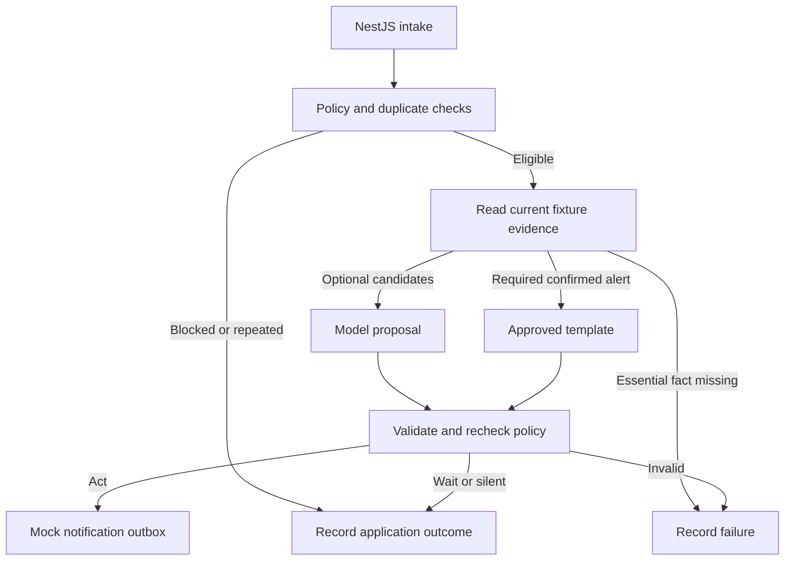

**Proactive AI: local demo and Cursor build brief**

Prepared for Raju Dandigam on September 25, 2026, using the current presentation with 22 main slides and two backups. This is an implementation brief; the application described below has not been built or run as part of this review.

**Recommendation**

Build a small local NestJS application with one LangGraph workflow, one optional model call, fixture-backed read tools, and a mock notification outbox. Use Jordan’s Boston trip from the presentation. Show the incoming request, the model’s structured proposal, the application’s checks, and the resulting notification or decision to wait or stay silent.

Give the demo five minutes. The practical goal is to make policy, evidence, judgment, and validation visible in one working example. A local workflow is enough to teach that idea; distributed workers and real notification delivery belong in the architecture explanation.

My planning estimate is 4–8 focused hours for a first working version, plus several hours for validation, recording, and rehearsal. This assumes a familiar NestJS setup and a tightly fixed scope. Package or API integration issues can extend that estimate. Keep the existing talk available until the demo can complete three rehearsals within five minutes. If preparation time is very short, show a recorded run with a few live explanations of its output.

**What I found in the existing repository**

Reviewed `rajudandigam/travel-booking-optimizer`, default branch `main`, commit `6e8f14bdaf9609b3467c997e8fa47ded2d02699e`.

| Current code | Consequence for this talk |
| --- | --- |
| TypeScript CLI with slow/fast runs and flight, hotel, and car search agents | Its current story is concurrency and booking search. |
| OpenAI, Zod, and agent-inspect dependencies; no NestJS or LangGraph dependencies | It is a reference for patterns, rather than an existing server for this demo. |
| Mock travel API responses and a fake LLM client used by tests | The separation between live and test implementations is useful to reuse. |
| `FlightAgent.parseRankings` ignores the LLM text and assigns scores by array position | Do not present that method as an example of the model determining the result. |
| The live LLM client hardcodes `gpt-4-turbo` | Make the new model configurable and verify structured-output support before rehearsing. |

Start a small separate repository, for example `proactive-ai-demo`, or use an already-working NestJS skeleton you own. Borrow the testing and tracing ideas. The existing repository was inspected through GitHub; its build and tests were not executed during this review.

**The story to demonstrate**

Keep the same traveler and trip throughout. All dates, records, and provider responses are fictional fixtures. A server-side demo clock makes “tomorrow” and “before arrival” repeatable on any presentation day.

| Run | Situation | Intended behavior | Responsibility |
| --- | --- | --- | --- |
| 1: trip review | Departure is 24 hours away; check-in is open; routine rain is forecast | One preparation notification can combine useful facts | Model proposes grouping and next step; application validates and renders |
| Same run | A verified road closure affects the hotel route tomorrow evening | Wait until the arrival-guidance window, then refresh the facts | Code computes the permitted window; model cannot send early |
| Same run | An older hotel search is unfinished, but the hotel is now booked | Stay silent for that reminder | Current booking evidence and application rule |
| 2: flight update | An important flight change has been confirmed | Prepare the required alert through its explicit policy and verified template | Application; no dependency on optional model judgment |
| 3: repeated event | Submit the same flight event again | Return the existing result without another logical notification | Application delivery ledger |

The first run contains the real OpenAI call. The second demonstrates why a required alert must work even when the optional AI path is unavailable. The third is a quick repeat of the previous command, not another feature tour.

Do not make a new model call for each signal. Gather the eligible optional candidates into one small context. The model can select useful facts, combine related updates, suggest an allowed next step, and recommend silence when nothing adds value. Application rules already resolve obvious cases such as completed hotel booking and a message outside its permitted time window.

**What to build**

| Component | Minimum implementation |
| --- | --- |
| NestJS controller | `POST /demo/intake`, `GET /demo/outbox`, and a local reset operation |
| Policy service | Optional-category consent, permitted channel, quiet hours, contact limit, and duplicate check |
| Mock read tools | Read trip, communication preferences/history, flight status, and destination information from local fixtures |
| LangGraph service | Explicit nodes and branches for policy, evidence, model proposal or required-alert template, validation, and result recording |
| Decision provider | Interchangeable `live` OpenAI and `fixture` implementations, both returning the same schema |
| Application validator | Schema checks plus evidence IDs, timing, allowed action, channel, completed bookings, and delivery policy |
| Outbox and ledger | In-memory notification previews and stable identities for repeated events within the running process |
| Trace | A small JSON record with node results, model mode, durations, versions, and final application outcomes |

Use LangGraph as a workflow inside a NestJS service. Start with one graph and one model node. Fixture read tools can be called directly by the evidence node; model-selected tool calls are an optional later extension. Be explicit about that distinction when presenting.

The model has no delivery tool. Only validated application code can write to the mock outbox.



For a planned wait, record `recheckAt` and the reason. The MVP does not need to sleep or run a background scheduler. An optional second fixture can simulate the later time and refreshed facts. Describe persistent queues, cancellation, provider reconciliation, and restart recovery using slide 16. An in-memory ledger does not demonstrate those production guarantees.

**A concrete request**

The following endpoint and commands are the target interface for Cursor to implement; they do not exist in the reviewed repository yet.

```json
{
  "eventId": "trip-review-001",
  "tripId": "trip-jordan",
  "type": "TRIP_REVIEW",
  "scenarioId": "jordan-before-departure",
  "signals": [
    { "id": "preparation-1", "type": "TRIP_PREPARATION" },
    { "id": "weather-1", "type": "WEATHER_UPDATE" },
    { "id": "route-1", "type": "DESTINATION_EVENT" },
    { "id": "search-1", "type": "HOTEL_SEARCH_ABANDONED" }
  ]
}
```

Here, `scenarioId` selects a server-side fixture bundle. This allows a short readable intake request while keeping the distinction between an incoming signal and the current facts retrieved by a tool. The fixture selector and clock are local demo controls, not production request fields. Use a fixed demo actor and an explicit fixture ownership check.

Implement this complete example fixture as a starting point. Provider labels mean mock sources in this application.

```json
{
  "scenarioId": "jordan-before-departure",
  "now": "2026-10-05T09:00:00-07:00",
  "actor": { "id": "demo-jordan" },
  "traveler": {
    "id": "demo-jordan",
    "name": "Jordan",
    "timeZone": "America/Los_Angeles",
    "preferences": {
      "optionalTripMessages": true,
      "allowedChannels": ["push"],
      "quietHours": { "start": "22:00", "end": "08:00" }
    }
  },
  "trip": {
    "id": "trip-jordan",
    "ownerId": "demo-jordan",
    "status": "active",
    "origin": "SFO",
    "destination": "BOS",
    "destinationTimeZone": "America/New_York",
    "departureAt": "2026-10-06T09:00:00-07:00",
    "arrivalAt": "2026-10-06T17:30:00-04:00",
    "hotel": { "status": "confirmed", "area": "Boston waterfront" }
  },
  "evidence": [
    {
      "id": "flight-status-v1",
      "source": "mock-flight-service",
      "checkedAt": "2026-10-05T09:00:00-07:00",
      "checkInOpen": true,
      "arrivalAt": "2026-10-06T17:30:00-04:00"
    },
    {
      "id": "hotel-booking-v1",
      "source": "mock-booking-service",
      "checkedAt": "2026-10-05T09:00:00-07:00",
      "status": "confirmed"
    },
    {
      "id": "weather-v1",
      "source": "mock-weather-service",
      "checkedAt": "2026-10-05T09:00:00-07:00",
      "forecastDate": "2026-10-06",
      "forecast": "rain",
      "severity": "routine"
    },
    {
      "id": "road-closure-v1",
      "source": "mock-city-service",
      "checkedAt": "2026-10-05T09:00:00-07:00",
      "verified": true,
      "affectsHotelRoute": true,
      "startsAt": "2026-10-06T16:00:00-04:00",
      "endsAt": "2026-10-06T20:00:00-04:00"
    }
  ],
  "recentActivity": [
    { "type": "HOTEL_SEARCH_ABANDONED", "at": "2026-10-04T12:00:00-07:00" },
    { "type": "HOTEL_BOOKED", "at": "2026-10-04T13:00:00-07:00" }
  ],
  "recentMessages": []
}
```

Put the demo policy in code or a versioned configuration file: preparation becomes eligible 24 hours before departure; arrival guidance becomes eligible two hours before arrival; optional pushes are limited to one in the preceding six hours. These are illustrative demo choices, not general travel-product recommendations. Required alerts have their own explicit category policy. In this fixture they use the allowed push channel; the model cannot invent an exception.

For the flight-change fixture, advance the clock to `2026-10-06T07:30:00-07:00` and update the mock flight source to confirm arrival at `2026-10-06T18:10:00-04:00`. A matching event references that source version. The arrival recheck moves from 15:30 to 16:10 in Boston time. Read the updated source rather than trusting the event’s claim of a change.

**Model proposal versus application result**

Use Structured Outputs with a schema supported by the chosen model. A compact proposal can include:

```json
{
  "decision": "act_now",
  "candidateIds": ["preparation-1", "weather-1"],
  "factIds": ["flight-status-v1", "weather-v1"],
  "templateId": "trip_preparation",
  "action": "view_trip",
  "recheckAt": null,
  "reasonSummary": "Combine the useful preparation details into one message."
}
```

The schema should also support `wait` and `silent`. Keep fields explicit and nullable where the outcome does not need them, then apply outcome-specific checks in code. A short reason summary is an explanation of the proposed result, not a request for hidden model reasoning. Record which decisions were made by code and which were proposed by the model.

For the initial demo, render the user-facing notification from validated fact IDs and known message fragments. For example: “Your Boston trip is tomorrow. Check-in is open, and rain is expected. View your trip plan.” This makes it possible to verify the claims shown to the user. If you later add free-form model wording, show it as a draft until its claims have been checked; the presence of evidence IDs alone does not prove that every sentence is supported.

An illustrative application result is:

```json
{
  "runStatus": "completed",
  "modelMode": "live",
  "modelCalls": 1,
  "decisions": [
    {
      "candidates": ["preparation-1", "weather-1"],
      "outcome": "act_now",
      "reason": "COMBINED_TRIP_PREPARATION"
    },
    {
      "candidates": ["route-1"],
      "outcome": "wait",
      "recheckAt": "2026-10-06T15:30:00-04:00",
      "reason": "ARRIVAL_GUIDANCE_NOT_DUE"
    },
    {
      "candidates": ["search-1"],
      "outcome": "silent",
      "reason": "HOTEL_ALREADY_BOOKED"
    }
  ],
  "outboxWrites": 1
}
```

This is a target example, not a captured model response. Live model wording and optional judgments can vary. Show both the proposal and the actual final application result rather than overwriting a model response to match a rehearsed answer.

Do not convert a timeout, refusal, incomplete response, or missing essential fact into a successful silent decision. Record a failure for the affected work and keep delivery blocked. If some candidates have already been resolved by code, preserve their outcomes separately and mark the run as partially failed. A required, verified alert can still use its independent template path.

**What you need locally**

- A Node.js version compatible with the selected NestJS and LangGraph packages, npm, and a working project lockfile.
- NestJS, `@nestjs/config`, `@langchain/langgraph`, the OpenAI JavaScript SDK, and compatible Zod dependencies. Use the SDK directly inside the model node to keep adapters minimal.
- `OPENAI_API_KEY`, an `OPENAI_MODEL` that your API project can use with Structured Outputs, and working API quota/network access.
- Local fixture data, an injectable clock, and a `live` versus `fixture` decision-provider setting.
- A terminal or API client and a large, readable output view.

No airline, weather, maps, email, or push-provider account is needed. Redis, a vector database, Docker, a hosted tracing product, and additional agent services are outside the minimum scope. Configure the key server-side through `.env`; keep it out of request files, logs, screenshots, and version control. Bind the demo server to localhost.

Set an explicit model timeout, for example 15 seconds, and disable hidden retry chains for the stage configuration. Keep optional calls bounded to one attempt per intake. Treat that timeout as a limit, not a promise of model latency. Warm up and test the selected model before presenting.

**Cursor prompt 1: build the working path**

Copy this brief into a new project and use the following prompt:

> Implement the MVP described in this brief as a local NestJS application using TypeScript and one LangGraph StateGraph. Inspect the project first and preserve an existing working NestJS skeleton if there is one. Check the current official package APIs, install compatible versions, and commit a lockfile. Create a DemoModule with intake controller, fixture tools, policy service, graph service, decision-provider interface, semantic validator, in-memory delivery ledger/outbox, and trace serializer. Use the OpenAI SDK directly inside the live provider and implement a deterministic fixture provider with the same output schema. Use a fixed server-side fixture clock. Implement the trip-review and confirmed-flight-change scenarios. Separate required alerts from optional model judgment. Only application code can record delivery. Produce a README and executable commands. Begin with the fixture provider so the full flow works without an API key, then wire the real structured-output call. Do not add a database, queue service, real notifications, multiple agents, cloud deployment, or a separate frontend framework. Do not present hand-authored fixture responses as live model output. Finish by running build, typecheck, and behavior tests, and report precisely what was and was not verified.

Suggested files:

| Path | Purpose |
| --- | --- |
| `src/demo/demo.controller.ts` | Local HTTP interface |
| `src/demo/decision.graph.ts` | Named workflow nodes and branches |
| `src/demo/policy.service.ts` | Deterministic rules and allowed choices |
| `src/demo/fixture-tools.service.ts` | Typed mock evidence access with ownership checks |
| `src/demo/decision-provider.ts` | Provider contract and structured proposal schema |
| `src/demo/openai-decision.provider.ts` | Real model request |
| `src/demo/fixture-decision.provider.ts` | Explicit deterministic development mode |
| `src/demo/validation.service.ts` | Application checks after the proposal |
| `src/demo/outbox.service.ts` | In-memory stable delivery identities |
| `src/demo/demo-clock.service.ts` | Repeatable time |
| `skills/trip-preparation.md` | Short versioned task guidance |
| `fixtures/` | Complete mock records and sample intake requests |
| `scripts/` | Scenario runner and readable output formatting |

**Cursor prompt 2: verify the behaviors that matter**

> Add focused tests for the demo’s actual risks: optional consent disabled and quiet hours stop a model call; current hotel booking suppresses the old search; route guidance cannot be sent before its allowed window; wait times must be future and useful; unknown evidence IDs and unsupported actions are rejected; missing essential flight evidence produces failure and no alert; missing optional weather does not block a verified flight alert; repeated event IDs and repeated logical delivery keys do not add outbox entries; model timeout/refusal does not become successful silence; live and fixture modes are clearly labelled. Test that changing the model proposal changes the application result when permitted and gets rejected when invalid, so the live response cannot be silently ignored. Test duplicate submissions concurrently as well as sequentially within the single running process. Add a small opt-in live evaluation command; ordinary tests must not spend API credits. Evaluate actions and supported facts rather than exact wording. Document that process restart clears the demo ledger and that no durable delivery guarantee is being made.

Use a logical delivery key based on trip, message purpose, and relevant source version. Do not use the generated message text as its identity. Event deduplication and delivery deduplication are separate checks. A repeated event returns the original result rather than being counted as a new product decision to stay silent.

**Cursor prompt 3: make it presentable**

> Add a terminal presentation view with four clear sections: input summary, model proposal, application decisions, and mock notification preview. Include a compact trace with policy result, evidence status, validation result, model-call count, and elapsed time. Clearly show LIVE or FIXTURE mode. Provide commands for reset, trip review, flight change, and replay of the last event. Make a README runbook with expected behavior, common setup failures, and a five-minute presentation script. If the terminal is already readable, stop there. A single HTML page served by NestJS is optional and should only be added after the complete demo and tests work. Keep it to scenario buttons and the same four panels. Do not add an editor, login system, animations, analytics dashboard, or streaming UI.

Suggested command interface to implement:

```bash
npm ci
cp .env.example .env
npm run start:dev
```

Set the key and chosen model privately in `.env`. In another terminal:

```bash
npm run demo:reset
npm run demo:trip
npm run demo:flight
npm run demo:repeat
```

Also support the underlying request for the audience:

```bash
curl -s http://127.0.0.1:3000/demo/intake \
  -H 'Content-Type: application/json' \
  --data-binary @fixtures/requests/trip-review.json
```

The scripts should call the running NestJS endpoint. `demo:repeat` must use the same event ID and source version as `demo:flight`. Reset both the ledger and fixture state before a fresh rehearsal. A saved live run or short video is the preferred presentation fallback; a fixture response is suitable too when clearly announced as fixture mode.

**Five-minute stage sequence**

| Time | Show | Suggested explanation |
| --- | --- | --- |
| 0:00–0:35 | Jordan’s request and a compact fixture summary | “We have the same trip from the slides. Before I run this, which of these updates would you want to receive?” |
| 0:35–1:50 | Trip review; model proposal beside final outcomes | “The model helps combine the useful details. The application has already ruled out the completed hotel search and set the earliest useful time for arrival guidance.” |
| 1:50–2:40 | Mock notification plus the wait and silent records | “Four signals have produced one message, one future check, and one reminder that should never be sent.” |
| 2:40–3:35 | Confirmed flight-change request | “Now an important flight update arrives. This follows its explicit alert policy and can use verified wording without waiting for optional AI.” |
| 3:35–4:05 | Repeat that exact request | “The request arrived twice, but it still represents the same notification.” |
| 4:05–5:00 | Compact decision trace, then return to slide 16 | “We can see the evidence, decision, and delivery result. This local app shows the decision flow. In production, scheduled work, restarts, and uncertain delivery responses also need to be handled.” |

Pre-open the files and terminal tabs, enlarge the font, and keep the JSON output short. Start the server before the talk. Avoid typing code live or opening several source files. If the API stalls, use the announced recorded run and continue the explanation.

**Slide changes: 19 main slides including the demo**

Use the original numbers from the current 22-slide deck while editing. Four slides move out of the main sequence and one demo slide is added: `22 - 4 + 1 = 19`.

| Original slide | Recommendation | Where the idea is covered |
| --- | --- | --- |
| 11 — Choose what deserves attention now | Move to backup | The demo makes these choices visible; slide 21 still gives the complete trip experience. |
| 14 — A skill describes how to do the job | Move to backup | Briefly show the short versioned guidance in the demo if needed. |
| 15 — Tools connect the agent to current facts | Move to backup | The fixture tools and evidence trace show the boundary; keep this slide for a code question. |
| 17 — Continue the conversation with fresh context | Move to backup | It is outside this intake-to-decision demo. Keep a short mention in the full-trip wrap-up. |
| After original slide 13 — Give the agent clear responsibilities | Insert “Let’s run Jordan’s trip” | Start the five-minute demonstration here. |

Main order: original slides **1–10, 12, 13, DEMO, 16, 18, 19, 20, 21, 22**. Keep slides 7–10: policy, evidence, judgment, and validation explain what the audience is about to observe. Keep slide 16 for the production runtime boundary, slide 18 for observability, and slides 19–20 for testing and success measures. The two existing backups remain available after their suggested evidence and delivery topics.

Suggested 30-minute allocation:

| Segment | Minutes |
| --- | ---: |
| Opening and Jordan’s problem, original 1–4 | 4 |
| Context and decision process, original 5–10 | 7 |
| Application and agent, original 12–13 | 3 |
| Demo | 5 |
| Runtime, observability, tests, metrics, original 16 and 18–20 | 5 |
| Complete experience and closing, original 21–22 | 2 |
| Questions or buffer | 4 |
| Total | 30 |

Trim the retained speaker notes to fit these blocks. Removing four slides alone does not create this timing. Use the demo transition: “We have seen the responsibilities on the diagram. Let’s run Jordan’s trip and watch which parts belong to the model and which parts the application controls.”

**References checked**

- [Existing repository](https://github.com/rajudandigam/travel-booking-optimizer/tree/6e8f14bdaf9609b3467c997e8fa47ded2d02699e)
- [Package dependencies](https://github.com/rajudandigam/travel-booking-optimizer/blob/6e8f14bdaf9609b3467c997e8fa47ded2d02699e/package.json)
- [Flight agent](https://github.com/rajudandigam/travel-booking-optimizer/blob/6e8f14bdaf9609b3467c997e8fa47ded2d02699e/src/agents/flight-agent.ts)
- [LangGraph JavaScript workflows and agents](https://docs.langchain.com/oss/javascript/langgraph/workflows-agents): explicit workflows and conditional routes support this design.
- [OpenAI Structured Outputs](https://developers.openai.com/api/docs/guides/structured-outputs): use a supported schema and model, handle refusal/incomplete results, and retain application checks because a schema-conforming response can still contain mistakes.
- [NestJS configuration](https://docs.nestjs.com/techniques/configuration): load and validate server-side environment configuration through the application.
