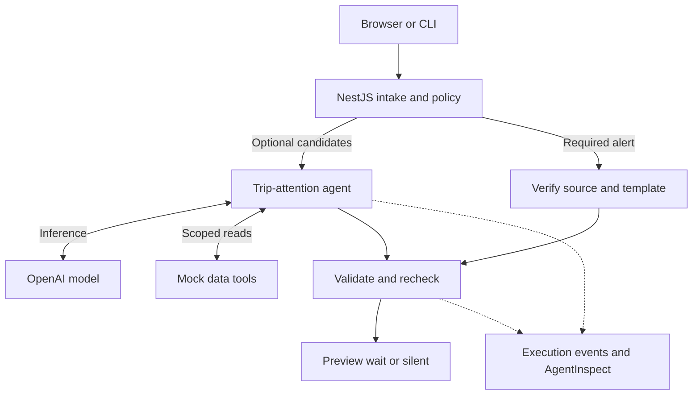
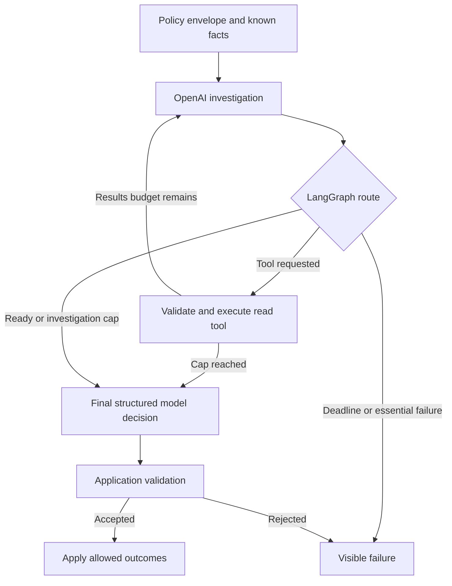

# System architecture (Demo V2)

```mermaid
flowchart TD
  U["Browser or CLI"] --> I["NestJS intake and policy"]
  I -->|"Optional candidates"| A["Trip-attention agent"]
  I -->|"Required alert"| R["Verify source and template"]
  A <-->|"Inference"| M["OpenAI model"]
  A <-->|"Scoped reads"| T["Mock data tools"]
  R --> V["Validate and recheck"]
  A --> V
  V --> O["Preview wait or silent"]
  A -.-> X["Execution events and AgentInspect"]
  V -.-> X
```

# Agent loop

```mermaid
flowchart TD
  C["Policy envelope and known facts"] --> L["OpenAI investigation"]
  L --> G{"LangGraph route"}
  G -->|"Tool requested"| T["Validate and execute read tool"]
  T -->|"Results budget remains"| L
  T -->|"Cap reached"| D
  G -->|"Ready or investigation cap"| D["Final structured model decision"]
  D --> V["Application validation"]
  G -->|"Deadline or essential failure"| F["Visible failure"]
  V -->|"Accepted"| O["Apply allowed outcomes"]
  V -->|"Rejected"| F
```
