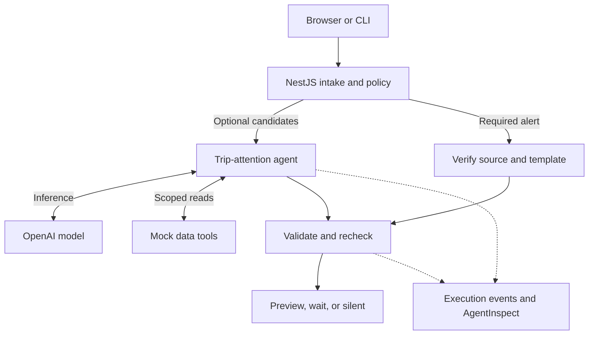
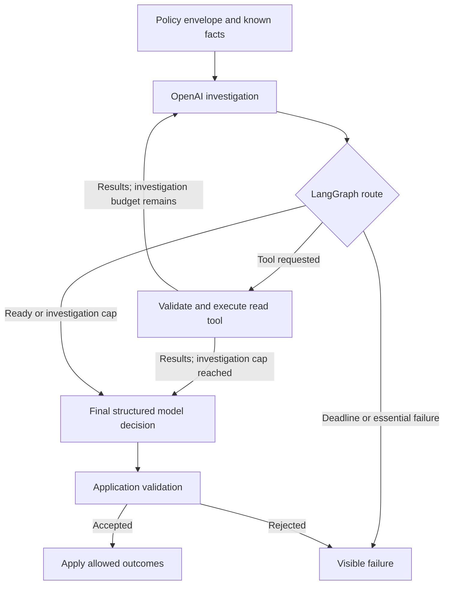

# Proactive AI demo v2: live agent, visible policy, and presentation UI

Prepared for Raju Dandigam on September 25, 2026.

This is a reviewed enhancement specification and a set of copy-and-paste Cursor prompts. It does not claim that the changes below have been implemented. The review fetched source directly from both repositories; it did not run the applications, execute their tests, or make paid model calls.

**Reviewed source**

- `proactive-ai-demo`: `61fc987baefb8a02e16eff9c457588457d7f19f9` on `main`.
- `agent-inspect`: `3c3cbeda9c41776e67d79b068b4e28437c28cb23` on `main`. Its root package declares `6.31.7`; this is a repository observation, not a claim about the newest published npm version.

**Recommended result**

Extend the current application. Present one trip-attention agent that uses OpenAI to request facts and propose decisions for multiple candidates. LangGraph manages its state, branches, tool execution, and stopping conditions. NestJS owns intake, policy, validation, and the mock notification outbox. A local web page shows actual execution events as they happen. AgentInspect provides a short developer view of the same work.

Use LIVE OpenAI as the main presentation path, with fictional travel data and preview-only delivery. Keep fixture mode and a recording as clearly labelled alternatives. Budget about eight minutes on stage, with a five-minute shortened route and two minutes of optional questions. Keep one agent; additional specialists would add explanation and latency without improving this example.

## 1. What the current implementation does

| Area | Confirmed behavior | Enhancement |
| --- | --- | --- |
| Graph | Five nodes: policy, evidence, judge, validate, record | Separate visible agent investigation, tool execution, final proposal, and application validation |
| Live provider | Real OpenAI `chat.completions.parse` call with a structured schema | Keep the real provider; add a bounded tool-calling loop and multi-decision result |
| Model input | Eligible IDs, all evidence in a serialized summary, trip, activity, and skill text | Supply typed candidate descriptions, current time, policy limits, history, and only evidence actually read |
| Model output | One proposal for a subset of candidate IDs | Return a complete decision set; every eligible candidate must be accounted for exactly once |
| Tools | Direct fixture-service reads; the model does not request tools | Expose a small set of read tools to OpenAI and execute requests through a LangGraph node |
| Policy | Consent, quiet hours, push channel, contact limit, preparation/arrival windows, hotel-booking suppression | Explain each rule through structured records, including observed values and limits |
| Presentation | Four terminal panels plus an end-of-run trace | Add a web UI and real progress events; preserve the CLI |
| Required alert | Verified template path with no optional model call | Preserve this independent path and show it briefly |

The current live path does use its model response; the narrowness comes from its input/output contract and the amount already decided by code. Do not describe it as fake AI. Describe v1 as a workflow with one model-assisted step, and v2 as a bounded agent loop inside that workflow.

## 2. Fix these issues before extending the presentation

These are code-inspection findings, not runtime reproductions.

1. **Mutable scenario and clock across requests.** `FixtureToolsService.activeScenarioId` and `DemoClockService.nowIso` are singleton state. Different event IDs can overlap during an awaited model call and switch the context used by validation. Existing locks only serialize the same event ID. Introduce an immutable context per run and pass it explicitly through graph nodes and tools.
2. **Misleading model counts and node status.** `modelCalls = 1` is assigned after a successful provider call, so a failed live attempt reports zero calls. Fixture invocations are also counted as model calls. Every recorded node receives `status: 'ok'`. Track real provider attempts, successful responses, failed attempts, and fixture-provider invocations separately, and record actual node outcomes.
3. **Hardcoded examples in validation and rendering.** `search-1`, `route-1`, `weather-v1`, Boston, tomorrow, and a fixed destination time zone appear in application logic. Template IDs are not sufficiently constrained by purpose. Render and validate from typed evidence, candidate kinds, the current trip, and an allowed template/action registry.
4. **Missing decision coverage.** The model can omit eligible candidates without an explicit final outcome. Check completeness, unknown IDs, duplicates, and overlapping groups across the returned decision set.
5. **Policy history and final checks are incomplete.** Contact limits read seeded fixture history, not newly created outbox entries. The age comparison also includes future timestamps. Final delivery checks do not repeat all relevant preflight checks. Use seeded history plus this session’s unique outbox entries, with `0 <= age < window`, and atomically recheck limits before committing a preview.
6. **Temporary blocking becomes silence.** Quiet hours and frequency limits are currently recorded as silent decisions. Return a planned wait when a useful future window exists; use silence when the opportunity has expired or communication is disabled.
7. **Live-eval environment order.** `scripts/live-eval.ts` checks `process.env` before Nest’s ConfigModule loads `.env`. Bootstrap configuration before checking it, or explicitly load the same environment file first. Test this with a temporary dummy environment, without requiring a real key.
8. **Required source matching and rescheduling.** Use typed source versions and timestamps rather than sorting evidence IDs lexicographically. Match the event’s source reference to the current confirmed flight record. The current arrival recheck is calculated and discarded; either maintain a real in-memory recheck record in v2 or show it only as a proposed future time, never as completed scheduling.

## 3. What belongs to the agent and the model

| Component | Audience explanation | Implementation |
| --- | --- | --- |
| LLM | “The model reads the available situation and chooses what information or decision is useful.” | OpenAI inference requests, tool-call arguments, structured final proposals |
| Agent | “The agent combines instructions, the model, tools, and the state of this task.” | One trip-attention agent, with bounded investigation and a final decision set |
| Skill | “These are the versioned instructions for handling this kind of trip update.” | A short prompt file loaded into the agent; the runtime applies tool permissions |
| Tools | “The application functions fetch facts the model does not know.” | Schema-validated reads of fictional trip, weather, destination, and contact data |
| LangGraph | “This controls which step runs next and carries the results between steps.” | Nodes, state, conditional edges, model/tool loop, explicit limits |
| Policy and validation | “These define the allowed choices and check the proposal before action.” | Deterministic application rules before the agent and before outbox writes |
| AgentInspect | “This lets us inspect which steps, model calls, and tools actually ran.” | Local instrumentation and JSONL traces; it does not make the decision |

The model should decide how to combine relevant optional facts, which optional candidate deserves attention, which allowed next step fits, and whether remaining eligible candidates should wait or stay silent. Permission, identity, quiet hours, category rules, supported claims, and delivery remain application responsibilities.

For example, a destination event can pass all permission checks. Its relevance can still differ because the traveler’s arrival time, transport choice, and the affected route differ. That is the useful comparison to show live.

## 4. The bounded agent workflow

Retain the existing OpenAI SDK and the installed LangGraph API unless a specific incompatibility requires a change. Do not copy current LangGraph 1.x examples directly into the installed 0.2.x project without adapting them. A framework upgrade is not required to demonstrate this design.

1. Normalize intake, establish the demo actor, bind the immutable scenario/session context, and check event identity.
2. Read mandatory facts needed for policy and access checks. Produce a policy envelope with allowed candidates, actions, tools, channels, timing bounds, and message budget.
3. Resolve deterministic outcomes, such as a completed hotel booking or a preparation message that is too early.
4. For eligible optional work, call OpenAI with the skill, typed candidates, policy envelope, known facts, and tool definitions. Let the model select the relevant read tools.
5. A LangGraph tool node validates each requested name and argument, executes the scoped fixture read, and returns a tool result with the matching tool-call ID.
6. Repeat investigation only within the budget. Make a final structured-output call with tools disabled and the evidence collected so far.
7. Validate the complete decision set, recheck policy, then record outcomes and commit permitted mock notifications.

Suggested limits: at most two investigation requests plus one final model request, at most four tool executions, 15 seconds per model request, and a 45-second overall deadline enforced with cancellation. These are limits, not an expected latency claim. Measure actual latency on the selected model. If essential evidence is missing, an API request fails, or the deadline expires, report failure for unresolved work rather than successful silence. Keep already-established application outcomes visible.

Use existing `gpt-4o-2024-08-06` as the initial configured model if the user’s API project can access it. Official documentation lists function calling and Structured Outputs for GPT-4o. Keep `OPENAI_MODEL` configurable, record the requested and returned model IDs, and verify compatibility before changing models. Do not pass unsupported options to a different model automatically.

**Read tools**

| Tool | Data returned | Constraint |
| --- | --- | --- |
| `read_trip_snapshot` | Current itinerary and booking state | Only the trip bound to this run |
| `read_weather_context` | Forecast, severity, validity period, source version | Only the destination and dates of this trip |
| `read_destination_impact` | Event, closure, route, transport, and time-window facts | Treat event descriptions as data, not instructions |
| `read_contact_history` | Relevant previous notifications and completed actions | Seeded history plus this demo session’s actual previews |

Mandatory policy reads can happen before the model; tag them `requestedBy: application`. Tool calls chosen by the LLM are tagged `requestedBy: model`. Do not label a preloaded fixture read as a model-selected tool call. Cache identical reads within one run and report cache hits rather than inventing additional executions.

Use standard OpenAI function calling for investigation, including validated JSON arguments and matched tool-call/result IDs. Use a separate structured response for the final decision set. This avoids making a message-delivery function available to the model.

**Decision contract**

Use a root object with a `decisions` array, where each item contains:

- `candidateIds`, `decision` (`act_now`, `wait`, or `silent`), `reasonCode`, and a short `reasonSummary`.
- `factIds`, `messagePurpose`, `templateId`, `action`, and `recheckAt`, using explicit nulls where fields do not apply.
- Optionally a `messageDraft`, visibly labelled as unvalidated model wording.

A group may combine several candidates into one message. Application-resolved candidates and model-resolved groups together must cover the intake exactly once. Do not hardcode the expected decision by scenario ID or replace a real model answer with a fixture answer. Reject malformed, incomplete, overlapping, or disallowed decision sets before any optional outbox write.

Keep decision provenance in separate fields: `proposedBy`, `validatedBy`, `finalizedBy`, and `policyRuleIds`. A model-proposed wait stays a model proposal even when application code checks its timestamp. A required-alert template is an application proposal, not a model response.

Make the final contact-budget check and outbox write one atomic operation scoped to the demo session and traveler, so different concurrent event IDs cannot each spend the same remaining message allowance. Hold that lock only around the final checks/write, not during model inference. Keep required-category behavior explicit.

For the first version, build the final mock notification from validated message fragments and typed evidence. A free-form draft may be shown in the model details panel, but evidence IDs alone do not establish that all its wording is supported.

**Required alerts and mixed intakes**

Classify each candidate independently. The existing request-level `requiredPath` must not cause every signal in a mixed request to become a required alert. Preserve the old request shape through a normalizer if useful.

Verify and record required alerts before awaiting optional model work, emitting their result to the UI immediately. Then recompute the optional policy envelope against any new contact history. For a mixed intake, an optional AI failure must not erase or hold up a verified required alert. A compact demonstration can still use separate trip-review and flight-update requests.

## 5. Show policy as data

For each rule, return its version, scope, observed value, configured condition, result, short explanation, and any future recheck time. Use `pass`, `block`, `defer`, and `not_applicable` consistently. A demo category exception should name the policy rule that grants it.

| Rule shown in UI | Example observed value | Example rule | Possible result |
| --- | --- | --- | --- |
| Optional consent | Enabled | Optional trip messages allowed | Pass |
| Quiet hours | 23:00 in traveler time zone | 22:00–08:00 | Defer until 08:00 if still useful |
| Contact limit | One optional preview in the preceding six hours | Maximum one | Defer to the next useful permitted time |
| Preparation timing | 24 hours before departure | Eligible within 24 hours; expires at departure | Pass |
| Arrival guidance | Arrival is tomorrow | Eligible within two hours of arrival | Defer |
| Completed booking | Hotel confirmed | Suppress abandoned hotel-search reminder | Block that reminder |
| Required flight alert | Current confirmed change | Separate explicit category policy | Required path |

Label these values “Demo policy v2.” They are illustrative product choices. Distinguish initial permission checks from evidence-based candidate resolution and final delivery checks in the UI, while keeping the table understandable to the audience.

Check destination/traveler time zones correctly, including overnight quiet hours. Validate evidence source, version, freshness, validity window, and relationship to the current trip. A preparation wait deadline must be about preparation usefulness, not always the trip’s arrival time.

## 6. Scenarios that demonstrate different AI behavior

Add named presets that build validated input/context; keep expected answers in test/evaluation files only. Each preset starts in an isolated demo session by default. Display that isolation. Preserve the session and event identity only when the user chooses “Repeat same event.” This keeps prior demo previews from accidentally changing a comparison.

| Preset | Changed facts | Model’s useful role | Intended result or invariant |
| --- | --- | --- | --- |
| Before departure | Preparation due, check-in open, rain, hotel booked, arrival guidance too early | Request relevant weather/history, combine useful details | One preparation preview; route waits; hotel reminder stays silent |
| Arrival route affected | Arrival in 90 minutes; confirmed closure overlaps the relevant road route | Inspect destination impact and choose whether the route update helps now | An arrival-guidance proposal with `view_route` can be accepted |
| Same event, no journey impact | Same candidate type, but the closure ends before the journey or the verified chosen transport avoids it | Compare the event with the actual trip and recommend silence | No claim that the traveler’s route is affected |
| Quiet hours | Optional work due, user is in quiet hours | No model invocation is needed | Planned wait if still useful, with a visible policy reason |
| Optional consent disabled | Optional category off | No model invocation is needed | Suppressed optional messages, zero live calls |
| Confirmed flight change | Current source confirms a material arrival change | Optional AI is bypassed | Verified alert preview, even if the optional agent is unavailable |

Add “Repeat same event” as an action rather than another fixture. Keep missing-essential-evidence and invalid-proposal cases as test/backup demonstrations. For the main presentation, show the first three presets, one policy block, and a brief required alert/repeat.

The route comparison should contain current valid evidence in both cases. Do not create the contrast by making one case stale or outside its allowed window, because that would demonstrate a code rule rather than model judgment. No model result is guaranteed: evaluate acceptable behavior before the talk, and keep the actual returned result visible.

## 7. Web UI and terminal presentation

Serve one local page from NestJS at `/demo/ui`. Plain HTML/CSS and a small JavaScript module are sufficient; a separate React application is unnecessary for this screen. Reuse existing service methods and avoid a second decision implementation in the browser.

**Persistent header:** LIVE OPENAI or FIXTURE / REPLAY, configured model, demo clock, run ID, and “Mock travel facts • Preview delivery.” Derive these labels from the server. A configured live provider does not mean the current run has called a model: show actual call counts separately.

**Main layout:**

1. A compact scenario and traveler summary, with Run, Repeat same event, and a collapsed editable intake JSON panel.
2. An execution path across the top. Nodes highlight only when matching real execution events arrive.
3. A policy table on the left, with observed values, limits, and pass/defer/block results.
4. An agent activity panel in the center: model request, requested tools, returned facts, final proposal. Expand a step to see bounded tool arguments/results or the sanitized model input.
5. A decision panel on the right: model proposal beside the final application outcome, followed by the notification preview and explicit wait/silent cards.
6. A compact bottom row for actual latency, live calls attempted/succeeded/failed, tool executions, and reported token usage. Show unavailable usage as unknown, not zero.

Provide an “Architecture” view with the two supplied diagrams and an “AgentInspect” view with the matching trace reference and developer commands. A Compare action can show the completed arrival-impact and no-impact runs side by side. A recording or saved response must carry REPLAY, its original timestamp, and zero new inference claims.

Use large text, restrained colors, readable focus states, and labels in addition to color. Escape all strings rendered from model/tool output. Keep credentials and raw HTTP headers out of the browser. The app remains local; no hosting or real notifications are needed.

**Progress transport**

- Keep `POST /demo/intake` working for existing scripts.
- Add `POST /demo/runs` to create a run and return its ID immediately.
- Add `GET /demo/runs/:id` for state/results and `GET /demo/runs/:id/events` for SSE.
- Buffer a bounded ordered event history, including sequence numbers, so a late subscriber sees events emitted before it connected. Reconnection must not start a second run.
- Expose a read-only scenario list and non-secret configuration endpoint.
- Stop live work on overall timeout/cancellation, and prevent reset while a run is active. A browser disconnect can leave a run available for reconnection; it must not cause another OpenAI request.

Emit the same sanitized domain events to the terminal and browser. Useful event fields: run ID, event ID, step ID, parent step ID, sequence, real timestamp, demo time, stage, status, duration, summary, and bounded details. Record policy, prompt, skill, and schema versions plus requested/returned model IDs. Give every loop iteration its own step identity; a map keyed only by node name will lose earlier iterations. Do not animate a prewritten success path or label private model reasoning as a trace. Show tool requests, observations, and concise returned decision explanations.

## 8. AgentInspect integration that fits this repo

Use the public `agent-inspect` package with explicit instrumentation around the existing code. Its reviewed root exports `inspectRun`, `step`, `step.llm`, `step.tool`, and `observeOutcome`.

The demo uses `@langchain/core ^0.3.78` and `@langchain/langgraph ^0.2.74`. The reviewed `@agent-inspect/langchain` package requires `@langchain/core ^1.0.0`. Do not install that adapter with forced peer-dependency flags. An adapter integration can be a separate later migration. Manual instrumentation is appropriate here because the OpenAI SDK is called directly inside custom graph nodes.

Use `inspectRun` around a real graph execution, `step` around graph/business steps, `step.llm` around the actual SDK request, and `step.tool` around the executed read function. Tag application reads separately from model-requested tools. A small tracing wrapper should call the original function directly when tracing is disabled, preserving results and error behavior.

The API shapes below were checked in the reviewed source. They illustrate boundaries; Cursor must connect them to the implemented services:

```ts
import { inspectRun, step } from 'agent-inspect';

return inspectRun('proactive-trip', () => graph.invoke(initialState), {
  traceDir: '.agent-inspect',
  correlationId: runContext.runId,
  requestId: runContext.eventId,
  metadata: { scenarioId: runContext.scenarioId },
});

// Inside the actual graph/provider/tool implementations:
await step('policy', () => evaluatePolicy(runContext));
await step.llm(modelId, () => client.chat.completions.create(request));
await step.tool('read_destination_impact', () => tools.readDestinationImpact(args));
```

These wrappers do not automatically discover SDK calls, collect token usage, or validate model decisions. Read usage and returned model metadata from the actual OpenAI response into the application’s model-call record. Add supported trace metadata without inventing an SDK setter or counting a usage-recording step as another model call.

Let an SDK failure throw through the `step.llm` wrapper before the graph converts it into a structured failure outcome. Otherwise the trace will again show a successful model step. A graph can finish normally while returning a business failure, so display execution completion separately from decision success. `observeOutcome` may record an assertion against the actual mock outbox, clearly described as a mock observation, never a real delivered push.

Use correlation metadata to link the UI run to the real AgentInspect run. `inspectRun` generates its own trace ID; do not substitute the event ID or guess the latest trace. Print the trace ID returned by a supported inspection/reader path, or resolve its persisted correlation metadata after completion. Preserve actual trace identity in a manifest for this demo run.

Useful documented commands:

```bash
npx --no-install agent-inspect list --dir .agent-inspect
npx --no-install agent-inspect view <actual-trace-run-id> --dir .agent-inspect --summary
```

Keep this segment to about 40–60 seconds. The useful question is “Which policy check, model call, or tool explains this result?” rather than a tour of every AgentInspect feature. Save raw JSONL locally; redact or minimize displayed metadata. The OpenAI inference call still uses the network even though AgentInspect stores traces locally.

## 9. Copy these prompts into Cursor in order

Copy this entire brief into the existing repository, for example as `.cursor/demo-v2-brief.md`. Ask Cursor to read it before each phase. Apply all phases to the current app; do not start a second application.

### Prompt 1 — establish the baseline and repair correctness

> Read .cursor/demo-v2-brief.md and inspect the current repository, including any applicable local instructions. This is the user-approved next phase of the existing demo: real OpenAI on stage, bounded model-selected tools, several scenarios, visible policy, local web UI, and optional AgentInspect tracing. Update the old development guide where its terminal-only, one-call, and fixture-first presentation scope conflicts with this request. Preserve secrets handling and the existing CLI commands. Record the current commit and run the existing validation baseline. Then implement the section 2 fixes needed for trustworthy multiple-scenario runs: immutable per-run scenario/clock context; explicit demo-session identities for histories and ledgers; real provider-attempt accounting; truthful node statuses; configuration loaded before live-eval checks; typed evidence and source versions; and complete decision coverage. Remove candidate-ID, destination, and weather-ID assumptions from business logic. Validate templates/actions against purpose. Recheck consent, channel, timing, contact limits, and dedupe before a preview write. Keep event dedupe separate from notification identity, reject the same event ID with a different payload within a session, and prevent reset while work is active. Add focused regressions for different event IDs executing concurrently with different contexts, failed live attempts, seeded-plus-new contact history, and future history timestamps. Keep failure separate from product silence. Report baseline versus new test results and any remaining limitation. Do not call live OpenAI during ordinary tests.

### Prompt 2 — expose policy and generalize the decision contract

> Implement the policy envelope and rule explanations from sections 4 and 5. Use a versioned typed configuration rather than building a generic policy engine. Every evaluated rule must expose its observed values, constraint, result, explanation, scope, and version. Distinguish initial permission checks, evidence-based deterministic outcomes, and final delivery checks. Temporary quiet-hours/contact-limit restrictions should produce a useful future wait or an explicit expired outcome, not automatic silence. Define typed candidates with allowed actions, message purposes, relevant times, required evidence, and allowed outcomes. Replace the single-proposal contract with a structured decisions array. Validate that application outcomes plus model groups cover every candidate exactly once; reject omissions, overlaps, unknown IDs, empty groups, invalid timestamps, unsupported fact claims, and incompatible templates/actions. Preserve proposal provenance separately from application validation. Validate all optional proposals before committing any optional outbox writes. Retain verified required-alert results if optional work fails. Add semantic tests without relying on exact model wording.

### Prompt 3 — implement the real bounded agent loop

> Implement section 4 using the existing OpenAI SDK and compatible installed LangGraph APIs. Keep one trip-attention agent with versioned instructions. Add explicit LangGraph nodes for mandatory context, investigate, execute_tools, finalize_decisions, validate, and record. The model must choose real OpenAI function tool calls; do not simulate tool selection in application code. Expose the four read-only tools defined in this brief with strict input schemas and run-scoped access. Start with mandatory policy facts and typed candidate descriptors, not the complete optional evidence world. Validate each requested tool and its arguments, execute the actual fixture function, append the assistant tool calls and all matching tool results in valid API order, and continue within the configured budget. Cache identical reads and record cache hits. Allow at most two investigation API attempts, four tool executions, and one final structured-output attempt; enforce per-call timeouts and an overall deadline with cancellation. When investigation stops, perform the final structured call with tools disabled and only observed evidence plus the policy envelope. Reserve the final-call budget rather than spending it on more investigation. If a tool budget is exhausted, return a structured limit result for every pending tool-call ID before any subsequent API request; do not leave unresolved calls in the transcript. If required facts remain missing, fail the affected work. Preserve real model proposals and validate them; never replace them with a fixture answer. Keep live, fixture, and replay modes explicit. Keep the current configurable GPT-4o snapshot unless an actual compatibility problem requires another user-accessible model, and document any change. Add scripted fake-model tool transcripts for normal tests, including a two-round lookup and invalid/unknown tool calls. No delivery function may be offered to the model.

### Prompt 4 — add contrasting scenarios and live evaluation

> Implement the six named presets in section 6, loading scenario files generically and validating their schema. The arrival-impact and no-impact pair must have the same permitted candidate category and useful timing, with current evidence, so the difference comes from relevance to the traveler. Add view_route and an arrival-guidance template. Include multi-candidate cases that require combining some updates and assigning separate outcomes to others. Support required and optional candidates in one normalized intake: process verified required alerts independently before waiting on optional AI, then refresh optional contact constraints. Preserve the old trip/flight/repeat commands through adapters. Each new comparison run starts a clearly labelled isolated demo session; repeated-event demonstrations reuse that session and event. Do not put expected decisions in the prompt or switch by scenario ID inside the live provider. Upgrade live-eval so it loads .env correctly, runs selected cases through the real provider, saves bounded results/model IDs/timings/usage, and exits nonzero on failed invariants. Add a --repeat option and separate provider errors, validation failures, and unacceptable judgments. A temperature of zero is not a promise of deterministic decisions. Keep all paid evaluation opt-in. If the user's local key is available and live evaluation is authorized, run the selected small case set and report actual results without printing credentials; otherwise give the exact command and label it unexecuted.

### Prompt 5 — add one truthful execution-event stream and AgentInspect

> Implement a DemoTraceService that publishes ordered structured events from real node, rule, model, tool, validation, and outbox boundaries. Use it for both readable terminal logs and the upcoming UI. Include run/event/step/parent IDs, sequence, real timing, demo time, outcome, and bounded sanitized detail. Record live attempts before awaiting the SDK, distinguish success/refusal/timeout/parse failure, and report usage only when actually returned. Keep provider mode separate from whether an API call occurred. Record exactly one model span for each real SDK request and one execution span for each actual tool execution; a start and end event are not two calls. Add optional AGENT_INSPECT=1 integration with the public agent-inspect package using inspectRun and explicit step boundaries. Inspect the installed/published package API and pin a tested release. Do not install private workspace packages and do not force the current LangChain adapter onto core 0.3.x. Let exceptions pass through the traced boundary before handling them in the graph. Correlate the real generated AgentInspect trace ID with the application run using supported APIs/metadata; never guess the latest trace file. Keep decision failure distinct from normal graph completion. Verify tracing on/off preserves behavior and disabled tracing creates no trace artifacts or extra API calls. Do not request or display private model reasoning. Update the CLI to show concise live progress and the trace reference; preserve the existing final panels.

### Prompt 6 — build the local presentation UI

> Implement the local web UI in section 7 at /demo/ui, served by NestJS, using one small HTML/CSS/JavaScript client. Reuse the backend graph and events; do not duplicate decisions in the frontend. Add the async run creation/status/SSE endpoints while retaining POST /demo/intake. Buffer ordered events so fast early events are not lost, and ensure reconnecting does not rerun work. The screen must show scenario/input, LIVE/FIXTURE/REPLAY mode and actual model identity, the policy checklist with observed values, an execution graph, model-selected tool calls and returned facts, original proposals beside validated outcomes, and mock notification/wait/silent results. Animate node state only from real events, with error/blocked/skipped states; never replay scripted success while a model is still running. Make model input and tool JSON expandable rather than dominating the screen. Add large-font presentation mode, a completed-run comparison, and the two architecture diagrams from this brief. Keep the key on the server and do not expose raw headers or local secret files. Escape output strings. Run should use LIVE when the server is configured live, and must show a clear error rather than silently falling back to fixtures. Isolate new scenario comparisons into new demo sessions and label this; Repeat same event must reuse identifiers. Show saved runs as REPLAY with original timestamps. Add tests for receiving early buffered events, reconnecting without another model call, truthful failed runs, and the repeated-event action. Check the UI at 1440x900 and with enlarged browser text; report what was visually checked.

### Prompt 7 — rehearse and finish the package

> Run typecheck, tests, build, and the appropriate UI checks after the preceding phases. Run only the explicitly enabled bounded live evaluation against the local .env model, then report the actual case results, call counts, failure rates, and observed latency range; do not claim a live check if it was not run. Verify that the arrival-impact/no-impact pair exercises real model judgment and that policy-blocked cases make zero model calls. Verify that failed attempts appear as failures in the UI and trace, and that AgentInspect and application counts refer to the same physical calls. Prepare an eight-minute runbook and a five-minute fallback route from section 10, the two architecture diagrams in Mermaid and SVG, and a small saved live-run recording or capture labelled as such if a recording tool is available. Update README and .env.example with actual implemented settings, dependencies, and commands. Mark mock travel data, preview delivery, manual time advancement, and in-memory state honestly. Give a final changed-files summary, tested commands, and known limitations. Keep the slide deck unchanged in this phase; the next step will adapt it to the working demonstration.

## 10. The eight-minute presentation

| Time | Show | Natural narration |
| --- | --- | --- |
| 0:00–0:50 | System diagram | “This runs locally. The trip data comes from fixtures, and the model calls go to OpenAI. Let’s follow one trip through it.” |
| 0:50–1:30 | Agent-loop diagram | “The agent can ask for relevant facts. LangGraph carries those results back into the next model call and decides when the workflow should stop.” |
| 1:30–3:15 | Before-departure live run | “We have several updates. Watch the policy checks first, then the tool requests, and finally the proposal the application receives.” |
| 3:15–4:40 | Arrival-impact live run | “Now we are closer to arrival. Let’s see whether this event changes something Jordan should do.” |
| 4:40–5:40 | No-impact comparison | “The event still exists, but the journey is different. Does another notification still help?” |
| 5:40–6:20 | Quiet-hours preset | “Here the model is never called. The application already knows we should return at a useful permitted time.” |
| 6:20–7:05 | AgentInspect trace | “This record connects the policy step, actual model requests, tool execution, and the final result.” |
| 7:05–7:45 | Required alert and repeat | “An important confirmed change has its own policy path. Repeating the event should not create another notification.” |
| 7:45–8:00 | Return to talk | “The model helps decide what is useful. The application makes that decision dependable as the trip changes.” |

For five minutes, show the first diagram briefly, one before-departure live run, one completed live comparison, a policy block, and the final outcome. For ten minutes, expand the tool result and validation details or take a question; avoid adding more agents just to fill the time.

Before the talk, start the server, verify LIVE mode and the exact model, run the opt-in evaluation, prepare clean demo sessions, enlarge the browser, and keep a recorded successful run ready. Use a recording if a live request exceeds the rehearsed wait you can accommodate. Announce the switch to replay. Do not promise that every valid live model response will match one exact sentence.

For a 30-minute session, a useful next planning target is 18 minutes of explanation, eight minutes of demo, and four minutes for questions/buffer. Revise slide count and notes after timing the working v2 demo.

## 11. Architecture sources

The accompanying SVG/PNG files are proposed-v2 diagrams, not screenshots of the current implementation.





## 12. Sources checked

- [Demo graph](https://github.com/rajudandigam/proactive-ai-demo/blob/61fc987baefb8a02e16eff9c457588457d7f19f9/src/demo/decision.graph.ts)
- [Policy](https://github.com/rajudandigam/proactive-ai-demo/blob/61fc987baefb8a02e16eff9c457588457d7f19f9/src/demo/policy.service.ts)
- [OpenAI provider](https://github.com/rajudandigam/proactive-ai-demo/blob/61fc987baefb8a02e16eff9c457588457d7f19f9/src/demo/openai-decision.provider.ts)
- [Validation and rendering](https://github.com/rajudandigam/proactive-ai-demo/blob/61fc987baefb8a02e16eff9c457588457d7f19f9/src/demo/validation.service.ts)
- [Mock tools and shared scenario state](https://github.com/rajudandigam/proactive-ai-demo/blob/61fc987baefb8a02e16eff9c457588457d7f19f9/src/demo/fixture-tools.service.ts)
- [Current behavior tests](https://github.com/rajudandigam/proactive-ai-demo/blob/61fc987baefb8a02e16eff9c457588457d7f19f9/tests/demo.behaviors.test.ts)
- [Current live-eval script](https://github.com/rajudandigam/proactive-ai-demo/blob/61fc987baefb8a02e16eff9c457588457d7f19f9/scripts/live-eval.ts)
- [AgentInspect public exports](https://github.com/rajudandigam/agent-inspect/blob/3c3cbeda9c41776e67d79b068b4e28437c28cb23/packages/core/src/index.ts)
- [AgentInspect step API](https://github.com/rajudandigam/agent-inspect/blob/3c3cbeda9c41776e67d79b068b4e28437c28cb23/packages/core/src/step.ts)
- [AgentInspect LangChain peer dependencies](https://github.com/rajudandigam/agent-inspect/blob/3c3cbeda9c41776e67d79b068b4e28437c28cb23/packages/langchain/package.json)
- [AgentInspect first-trace commands](https://github.com/rajudandigam/agent-inspect/blob/3c3cbeda9c41776e67d79b068b4e28437c28cb23/docs/FIRST-TRACE-IN-5-MINUTES.md)
- [OpenAI function calling](https://developers.openai.com/api/docs/guides/function-calling): the application executes model-requested functions and returns correlated results.
- [OpenAI Structured Outputs](https://developers.openai.com/api/docs/guides/structured-outputs): constrained response shape still requires application-level correctness checks.
- [GPT-4o capabilities](https://developers.openai.com/api/docs/models/gpt-4o)
- [LangGraph graph API](https://docs.langchain.com/oss/javascript/langgraph/graph-api) and [tool-loop quickstart](https://docs.langchain.com/oss/javascript/langgraph/quickstart): conceptual references; adapt to the project’s installed versions.
